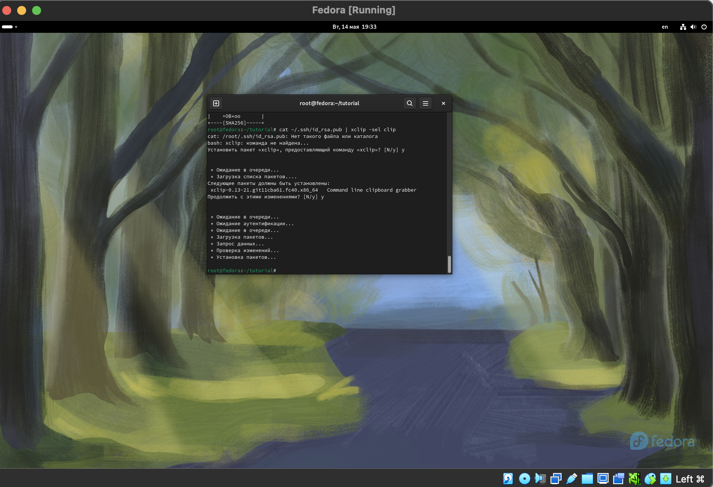
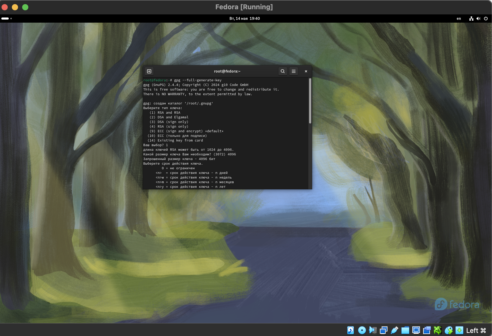
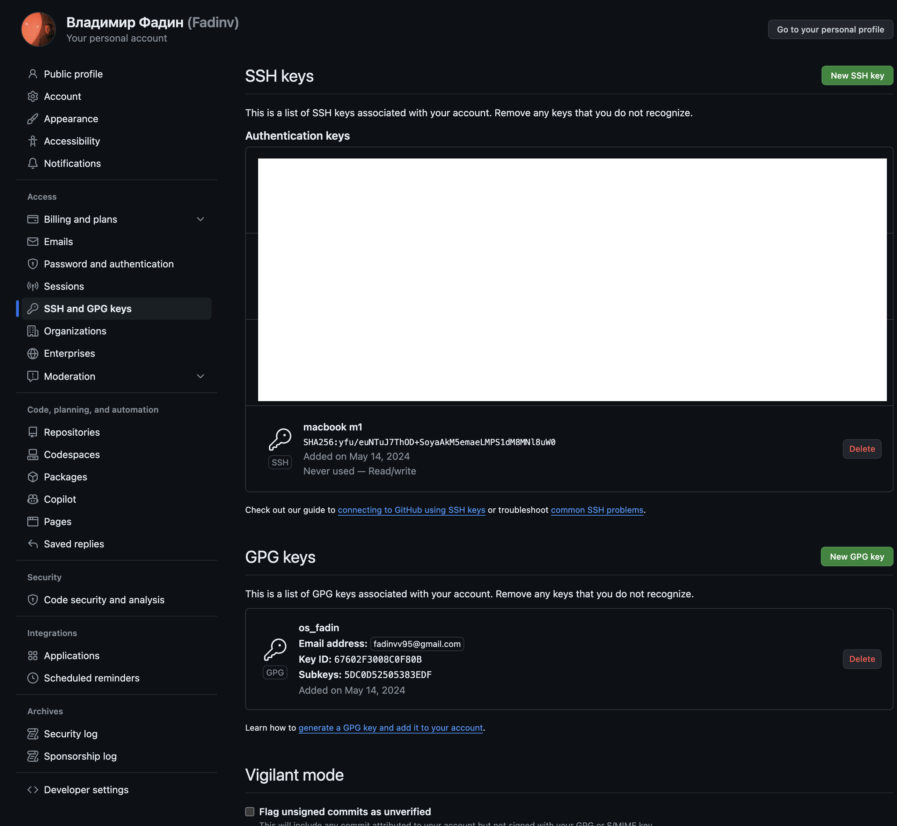
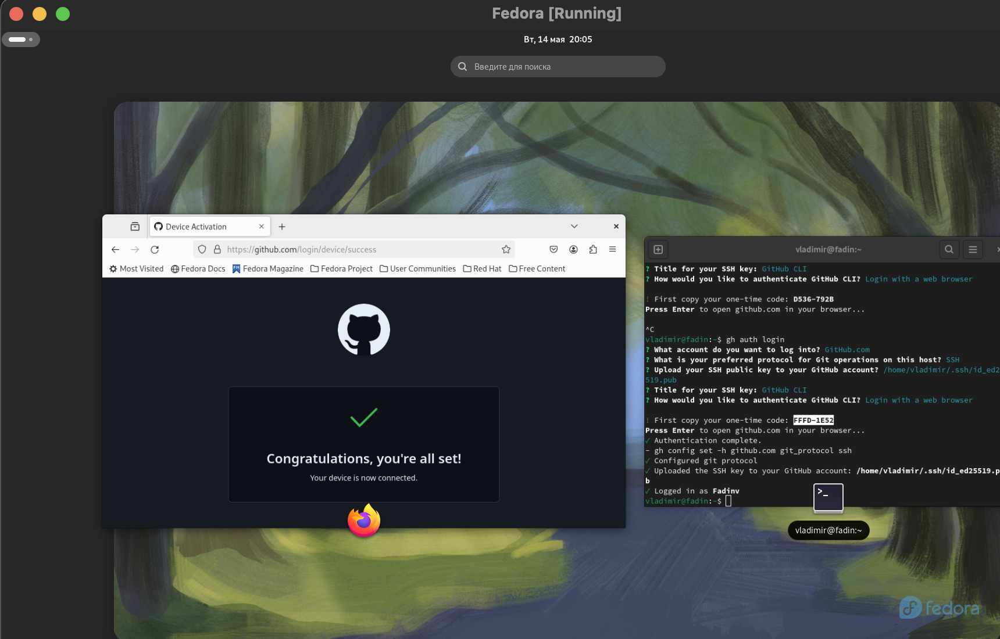
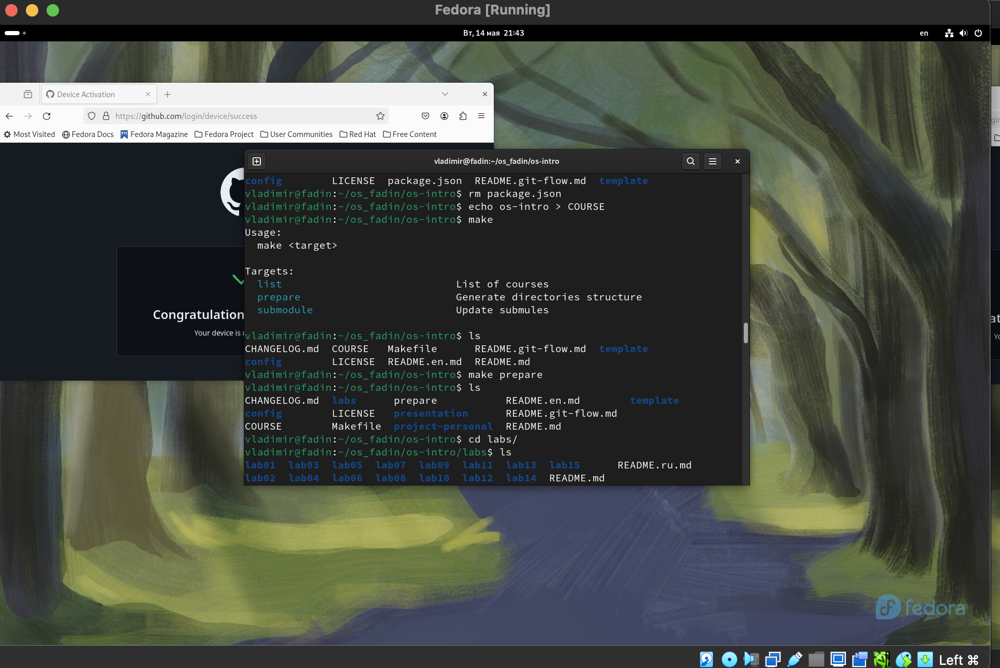

---
## Front matter
title: "Лабораторная работа №2 Первоначальная настройка git"
subtitle: "Дисциплина Операционные системы"
author: "Фадин В.В. НПМбв-02-20"

## Generic otions
lang: ru-RU
toc-title: "Содержание"

## Bibliography
bibliography: bib/cite.bib
csl: pandoc/csl/gost-r-7-0-5-2008-numeric.csl

## Pdf output format
toc: true # Table of contents
toc-depth: 2
lof: true # List of figures
lot: true # List of tables
fontsize: 12pt
linestretch: 1.5
papersize: a4
documentclass: scrreprt
## I18n polyglossia
polyglossia-lang:
  name: russian
  options:
	- spelling=modern
	- babelshorthands=true
polyglossia-otherlangs:
  name: english
## I18n babel
babel-lang: russian
babel-otherlangs: english
## Fonts
mainfont: PT Serif
romanfont: PT Serif
sansfont: PT Sans
monofont: PT Mon
mainfontoptions: Ligatures=TeX
romanfontoptions: Ligatures=TeX
sansfontoptions: Ligatures=TeX,Scale=MatchLowercase
monofontoptions: Scale=MatchLowercase,Scale=0.9
## Biblatex
biblatex: true
biblio-style: "gost-numeric"
biblatexoptions:
  - parentracker=true
  - backend=biber
  - hyperref=auto
  - language=auto
  - autolang=other*
  - citestyle=gost-numeric
## Pandoc-crossref LaTeX customization
figureTitle: "Рис."
tableTitle: "Таблица"
listingTitle: "Листинг"
lofTitle: "Список иллюстраций"
lotTitle: "Список таблиц"
lolTitle: "Листинги"
## Misc options
indent: true
header-includes:
  - \usepackage{indentfirst}
  - \usepackage{float} # keep figures where there are in the text
  - \floatplacement{figure}{H} # keep figures where there are in the text
---

# Цель работы
- Изучить применение средств контроля версий
- Освоить умения по работе с git'ом

# Выполнение лабораторной работы

## Настройка GIT

  Сконфигурируем `git` и создадим `SSH` ключ

{#fig:001 width=70%}
{#fig:001 width=70%}
{#fig:001 width=70%}
{#fig:001 width=70%}
{#fig:001 width=70%}

  Создадим PGP ключ

{#fig:002 width=70%}

С помощью команды `gpg --armor --export <PGP Fingerprint> | xclip -sel clip`  скопируем PGP ключ.
И вставим в наш Github.

{#fig:004 width=70%}
{#fig:004 width=70%}

Авторизируемся в Github

{#fig:005 width=70%}

## Создание рабочего пространства

Переходим в репозиторий с шаблоном и создаем из него шаблон.

{#fig:006 width=70%}

Перейдем в репозиторий и удалим `package.json`
Также создадим файл COURSE с текстом "os-intro"

{#fig:008 width=70%}

Теперь запушим изменения. До этого исполнив `git add` и `git commit` с названием коммита `feat(main): make course structure`

{#fig:009 width=70%}

# Ответы на контрольные вопросы

#### Что такое системы контроля версий (VCS) и для решения каких задач они предназначаются?

Системы контроля версий (VCS) предназначены для отслеживания изменений в программном коде и обеспечения коллективной разработки.

#### Объясните следующие понятия VCS и их отношения: хранилище, commit, история, рабочая копия.

Хранилище: Место, где хранятся все изменения и версии программного кода. 
Commit: Отдельное изменение или набор изменений в коде, зафиксированное в системе контроля версий. 
История: Последовательность коммитов, отображающая эволюцию кода. 
Рабочая копия: Локальная копия проекта, с которой работает разработчик.

#### Что представляют собой и чем отличаются централизованные и децентрализованные VCS? Приведите примеры VCS каждого вида.

Децентрализованные VCS копируют всю историю изменений на каждый  клиентский компьютер, в то время как централизованные VCS хранят все  изменения на центральном сервере и клиенты получают только последние  версии файлов. Примеры децентрализованных VCS: Git, Mercurial. Примеры  централизованных VCS: Subversion, CVS.

#### Опишите действия с VCS при единоличной работе с  хранилищем.

При индивидуальной разработке пользователь клонирует проект на свой  компьютер, вносит изменения и создает новые версии, коммитя их в системе контроля версий.

#### Опишите порядок работы с общим хранилищем VCS.

Пользователь получает версию проекта из центрального хранилища, вносит изменения, коммитит их и отправляет обратно в хранилище.

#### Каковы основные задачи, решаемые инструментальным средством git?

Git используется для разработки проектов в команде, контроля изменений в файлах и возможности сохранения нескольких состояний проекта.

#### Назовите и дайте краткую характеристику командам git.

`git add` - добавляет изменения для коммита.

`git commit` - сохраняет изменения в репозитории с названием.

`git push` - отправляет изменения на удаленный репозиторий.

`git config` - позволяет изменить настройки Git.

#### Приведите примеры использования при работе с локальным и удалённым репозиториями.

В локальном репозитории разработчик может вносить изменения в код и  коммитить их без доступа к сети. В удаленном репозитории команда  разработчиков может совместно работать над проектом, обмениваясь  изменениями через централизованный сервер.

#### Что такое и зачем могут быть нужны ветви (branches)?

Ветви используются для параллельной разработки функций или исправлений,  чтобы избежать конфликтов между изменениями и обеспечить безопасное  тестирование нового кода.

#### Как и зачем можно игнорировать некоторые файлы при commit?

Файлы могут быть проигнорированы с помощью файла .gitignore, чтобы  избежать загрязнения репозитория лишними или конфиденциальными файлами.

# Выводы

Мы изучили идеологию применения средств контроля версий и освоили базовые комманды git'а. 

