---
## Front matter
title: "Отчет по лабораторной работе №5"
subtitle: "Операционные системы"
author: "Фадин В.В."

## Generic otions
lang: ru-RU
toc-title: "Содержание"

## Bibliography
bibliography: bib/cite.bib
csl: pandoc/csl/gost-r-7-0-5-2008-numeric.csl

## Pdf output format
toc: true # Table of contents
toc-depth: 2
lof: true # List of figures
lot: true # List of tables
fontsize: 12pt
linestretch: 1.5
papersize: a4
documentclass: scrreprt
## I18n polyglossia
polyglossia-lang:
  name: russian
  options:
	- spelling=modern
	- babelshorthands=true
polyglossia-otherlangs:
  name: english
## I18n babel
babel-lang: russian
babel-otherlangs: english
## Fonts
mainfont: PT Serif
romanfont: PT Serif
sansfont: PT Sans
monofont: PT Mono
mainfontoptions: Ligatures=TeX
romanfontoptions: Ligatures=TeX
sansfontoptions: Ligatures=TeX,Scale=MatchLowercase
monofontoptions: Scale=MatchLowercase,Scale=0.9
## Biblatex
biblatex: true
biblio-style: "gost-numeric"
biblatexoptions:
  - parentracker=true
  - backend=biber
  - hyperref=auto
  - language=auto
  - autolang=other*
  - citestyle=gost-numeric
## Pandoc-crossref LaTeX customization
figureTitle: "Рис."
tableTitle: "Таблица"
listingTitle: "Листинг"
lofTitle: "Список иллюстраций"
lotTitle: "Список таблиц"
lolTitle: "Листинги"
## Misc options
indent: true
header-includes:
  - \usepackage{indentfirst}
  - \usepackage{float} # keep figures where there are in the text
  - \floatplacement{figure}{H} # keep figures where there are in the text
---

# Цель работы

Ознакомление с файловой системой Linux, её структурой, именами и содержанием каталогов. Приобретение практических навыков по применению команд для работы с файлами и каталогами, по управлению процессами (и работами), по проверке использования диска и обслуживанию файловой системы.

# Выполнение лабораторной работы

## Часть 1. Примеры

### Команды для работы с файлами и каталогами.

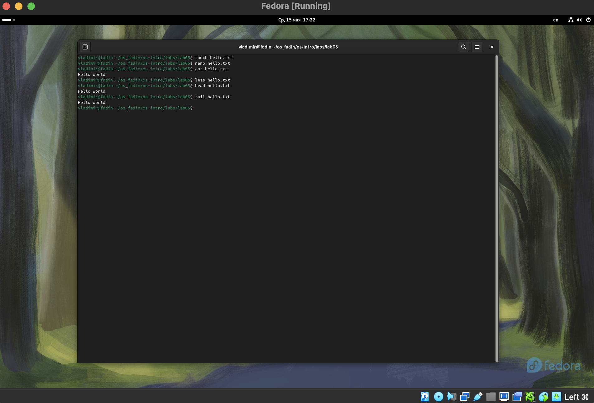{#fig:001 width=70%}

Копирование файлов и каталогов, а также их перемещение и переименование.

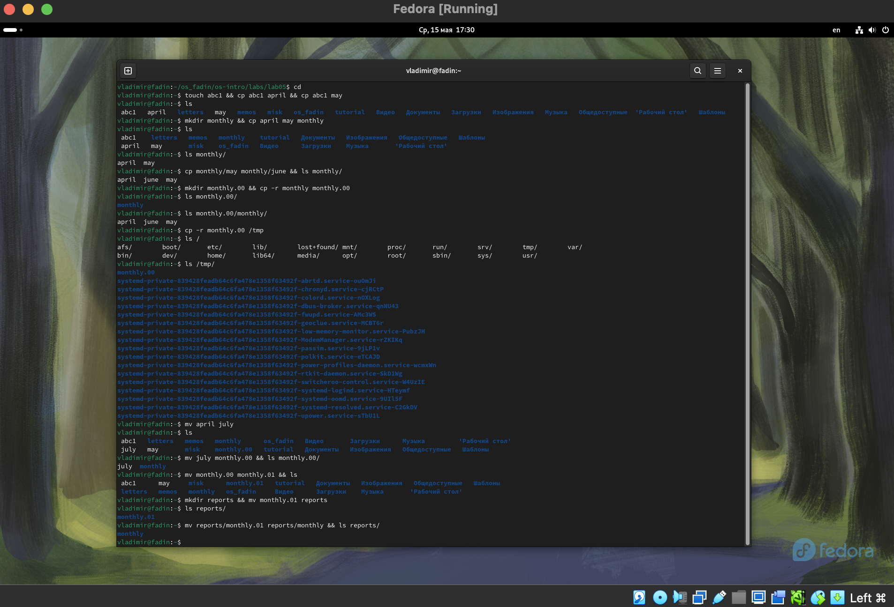{#fig:002 width=70%}

Копирование файлов и каталогов, а также их перемещение и переименование.

{#fig:002 width=70%}

Права доступа.

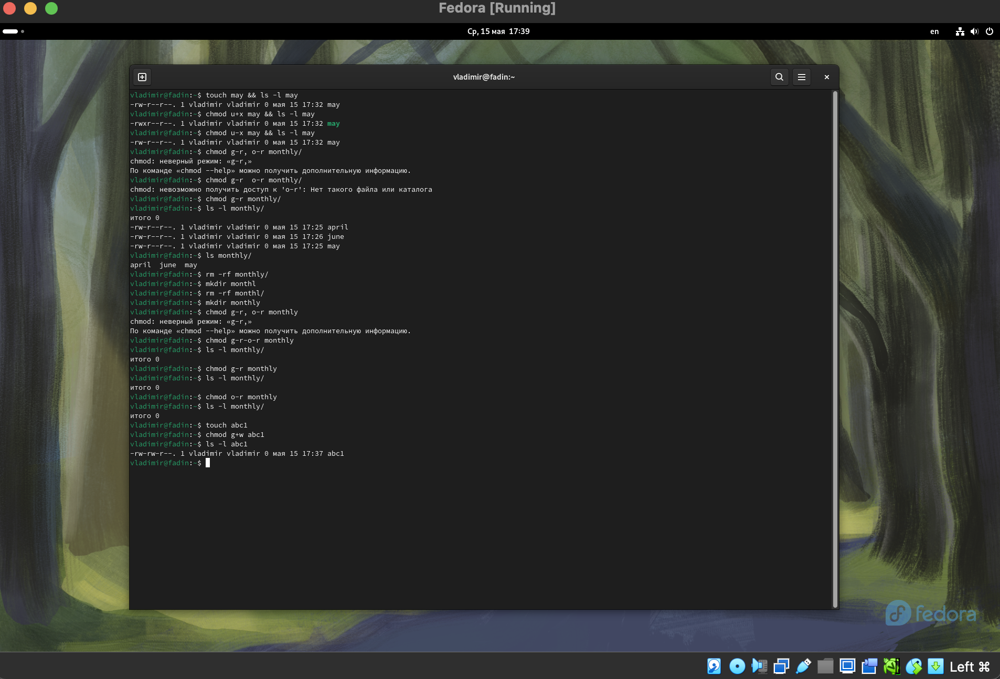{#fig:002 width=70%}

### Анализ файловой системы.

Для просмотра используемых в операционной системе файловых систем можно воспользоваться командой mount без параметров. В результате её применения можно получить примерно следующее:

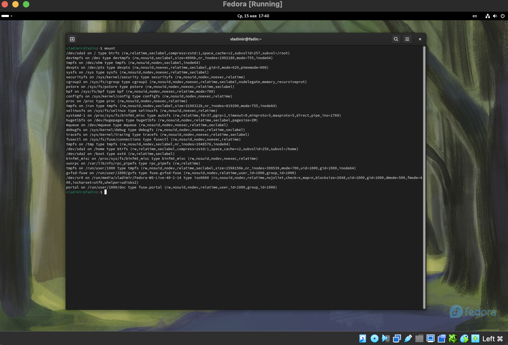{#fig:002 width=70%}

Другой способ определения смонтированных в операционной системе файловых систем — просмотр файла/etc/fstab. Сделать это можно например с помощью команды cat.
Для определения объёма свободного пространства на файловой системе можно воспользоваться командой df, которая выведет на экран список всех файловых систем в соответствии с именами устройств, с указанием размера и точки монтирования.
С помощью команды fsck можно проверить (а в ряде случаев восстановить) целостность файловой системы.

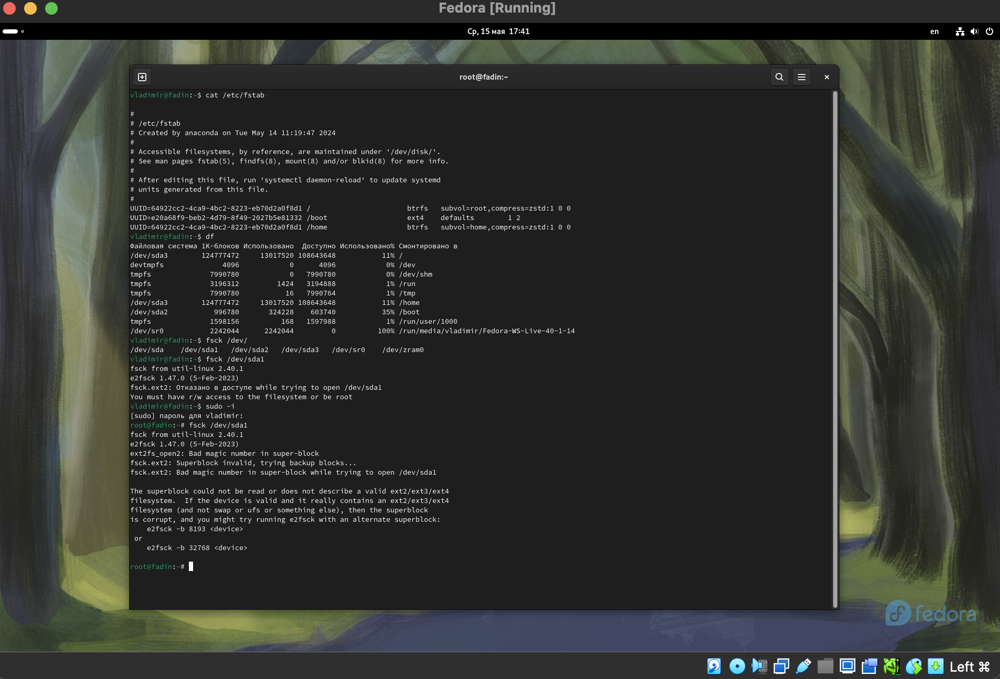{#fig:002 width=70%}

## Часть 2. Работа с fs

Выполнение следующих инструкций приведено на рис. ниже
- 2.1 Скопируйте файл /usr/include/sys/io.h в домашний каталог и назовите его
equipment. Если файла io.h нет, то используйте любой другой файл в каталоге
/usr/include/sys/ вместо него.
- 2.2. В домашнем каталоге создайте директорию ~/ski.plases.
- 2.3. Переместите файл equipment в каталог ~/ski.plases.
- 2.4. Переименуйте файл ~/ski.plases/equipment в ~/ski.plases/equiplist.
- 2.5. Создайте в домашнем каталоге файл abc1 и скопируйте его в каталог
~/ski.plases, назовите его equiplist2.
- 2.6. Создайте каталог с именем equipment в каталоге ~/ski.plases.
- 2.7. Переместите файлы ~/ski.plases/equiplist и equiplist2 в каталог
~/ski.plases/equipment.
- 2.8. Создайте и переместите каталог ~/newdir в каталог ~/ski.plases и назовите
его plans.

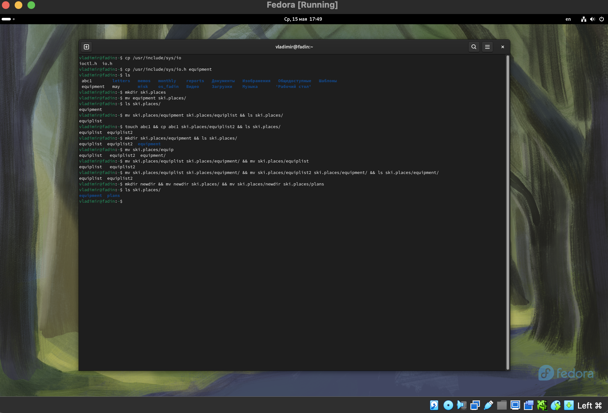{#fig:002 width=70%}

## Часть 3. Права доступа

Для выполнения этого задания потребуется создать две папки и два файла, а также настроить права доступа для них.

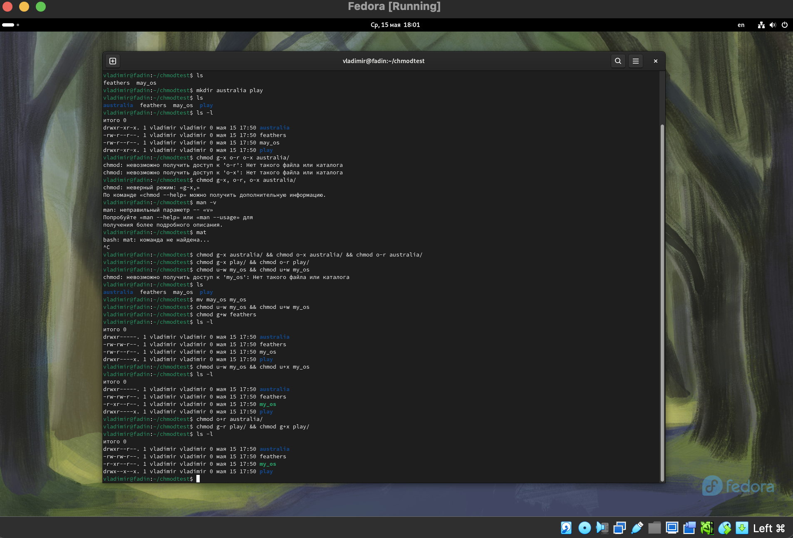{#fig:002 width=70%}

## Часть 4. Вызов команд по работе с fs с ограничением прав на файлы и папки

Просмотр файла /etc/passwd

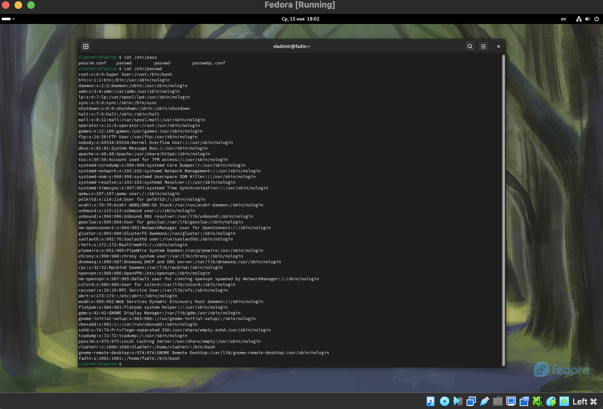{#fig:002 width=70%}

Просмотр файла /etc/passwd

Как видно из рисунка ниже, ограничение прав на файлы и папки делает невозможным совершение определенных действий с ними.

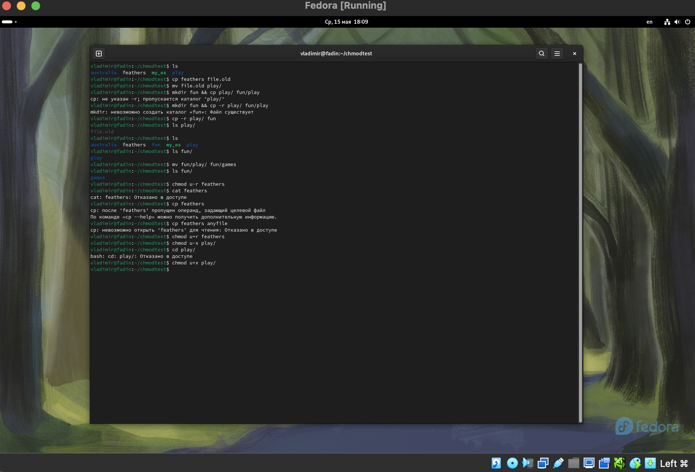{#fig:002 width=70%}

## Часть 5. Команды mount, fsck, mkfs, kill

После перевода описания, мы можем сказать, что команда mount используется для присоединения файловой системы к файловой иерархии Linux, обеспечивая доступ к файлам и каталогам на устройстве или разделе. Команда принимает несколько параметров, включая устройство или раздел для монтирования, точку монтирования (каталог) и тип файловой системы. Команду монтирования также можно использовать для вывода списка всех смонтированных файловых систем, указания параметров монтирования и перемонтирования файловой системы.

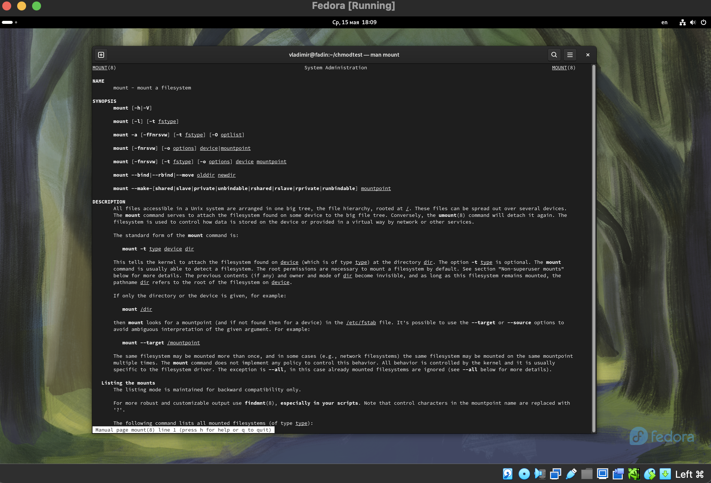{#fig:002 width=70%}

Команда fsck (File System Check) в Linux Fedora - это утилита, которая проверяет целостность файловой системы на жёстком диске или другом устройстве хранения данных. Она помогает обнаружить и исправить ошибки в файловой системе, такие как повреждённые файлы, неразрешённые ссылки и другие проблемы, которые могут привести к сбоям системы или потере данных. Fsck может быть запущена вручную или автоматически при запуске системы, и она особенно полезна после сбоев системы или при обнаружении ошибок на диске.

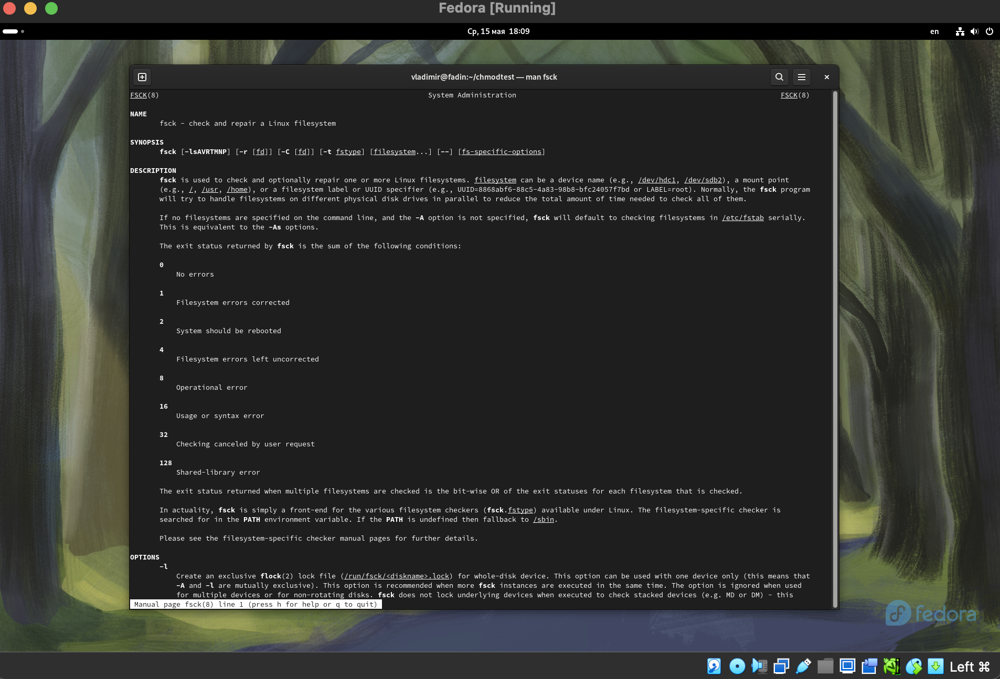{#fig:002 width=70%}

Вызвав команду man mkfs, мы узнаем, что mkfs - это команда для создания файловой системы на устройстве или разделе диска. Она позволяет создавать различные типы файловых систем, такие как ext2, ext3, ext4, FAT, NTFS и другие. Команда mkfs обычно используется при установке операционной системы, создании новых разделов или при необходимости изменить тип файловой системы на существующем разделе. Например, чтобы создать файловую систему ext4 на устройстве /dev/sda1, мы можем использовать команду mkfs.ext4 /dev/sda1.

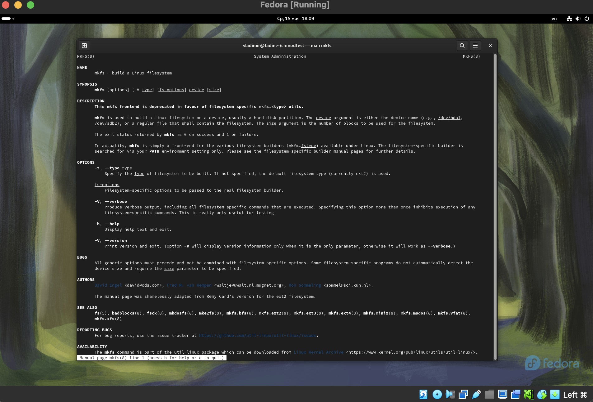{#fig:002 width=70%}

Команда kill используется для завершения процесса путем отправки ему сигнала. Основной синтаксис — kill [сигнал] [идентификатор_процесса], где [сигнал] — необязательный номер или имя сигнала, а [идентификатор_процесса] — идентификатор процесса, который необходимо завершить. Если сигнал не указан, отправляется сигнал SIGTERM по умолчанию (15), который позволяет корректно завершить процесс. Однако, если процесс не отвечает, можно использовать опцию -9 или -KILL для немедленного принудительного завершения, минуя любую процедуру завершения работы. Команду kill также можно использовать с другими параметрами, например -l, чтобы вывести список всех доступных сигналов, или с такими командами, как pkill или killall, для завершения процессов по имени, а не по идентификатору.

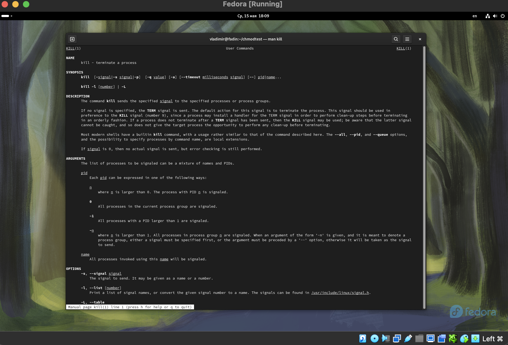{#fig:002 width=70%}

# Выводы

В данной лабораторной работе я ознакомился с файловой системой Linux, её структурой, именами и содержанием каталогов. Приобрел практические навыки по применению команд для работы с файлами и каталогами, по управлению процессами (и работами), по проверке использования диска и обслуживанию файловой системы.

# Ответы на онтрольные вопросы

1.  Характеристика fs показана на рис. ниже.

{#fig:002 width=70%}

2. Структура файловой системы.
В Linux файловая система организована в иерархическую структуру с корневым каталогом (/) наверху. Корневой каталог содержит несколько подкаталогов, каждый со своим набором файлов и подкаталогов. Основными каталогами первого уровня структуры файловой системы Linux являются:
- /bin: основные двоичные исполняемые файлы (команды), используемые системным администратором.
- /boot: файлы, необходимые для загрузки системы, включая файлы конфигурации ядра и загрузчика.
- /dev: файлы устройств, которые используются для взаимодействия с аппаратными устройствами.
- /etc: файлы конфигурации системы, включая информацию о пользователе и файлы запуска.
- /home: домашние каталоги пользователей, в которых хранятся личные файлы и данные.
- /lib: общие библиотеки, которые используются программами для выполнения определенных задач.
- /media: точки монтирования съемных носителей, таких как USB-накопители и компакт-диски.
- /mnt: временные точки монтирования файловых систем.
- /opt: дополнительные пакеты и программы, которые не являются обязательными для системы.
- /proc: виртуальная файловая система, предоставляющая информацию об оборудовании и процессах системы.
- /root: домашний каталог пользователя root.
- /sbin: системные двоичные исполняемые файлы (команды), используемые системным администратором.
- /sys: виртуальная файловая система, предоставляющая информацию об оборудовании и ядре системы.
- /tmp: временные файлы, которые удаляются при перезапуске системы.
- /usr: пользовательские программы и данные, включая документацию и исходный код.
- /var: переменные данные, такие как журналы и файлы очереди.

3. Операция mount.
4. Основные причины нарушения целостности файловой системы:
- Отсутствие синхронизации между образом файловой системы в памяти и ее данными на диске в случае аварийного останова
- Ошибки при записи или чтении данных на диск
- Физические повреждения диска или оборудования
- Неправильное использование команд или утилит, работающих с файловой системой
Для устранения повреждений файловой системы используются утилиты, такие как fsck (для Linux/Unix-подобных систем) и SFC (для Windows 10). Эти утилиты проверяют целостность файловой системы, обнаруживают ошибки и предлагают исправить их. В некоторых случаях может потребоваться ручное вмешательство для исправления ошибок.
5. С помощью утилиты mkfs, создается файловая система в выбранном разделе.
6. Команды для просмотра текстовых файлов:
- cat - выводит содержимое файла на экран
- more - постраничный просмотр содержимого файла
- less - более удобный просмотр файла, позволяет прокручивать текст и искать текст внутри файла
- nl - выводит содержимое файла с номерами строк
- grep - поиск фрагментов текста в текстовых файлах
7. Команда cp используется для копирования файлов и папок.
8. Команда mv используется для перемещения и переименования файлов и папок.
9. Права доступа ограничивают действия (чтение, запись и инициализация) над файлами и папками. Изменены они могут с помощью команды chmod [rights] [file/directory].

