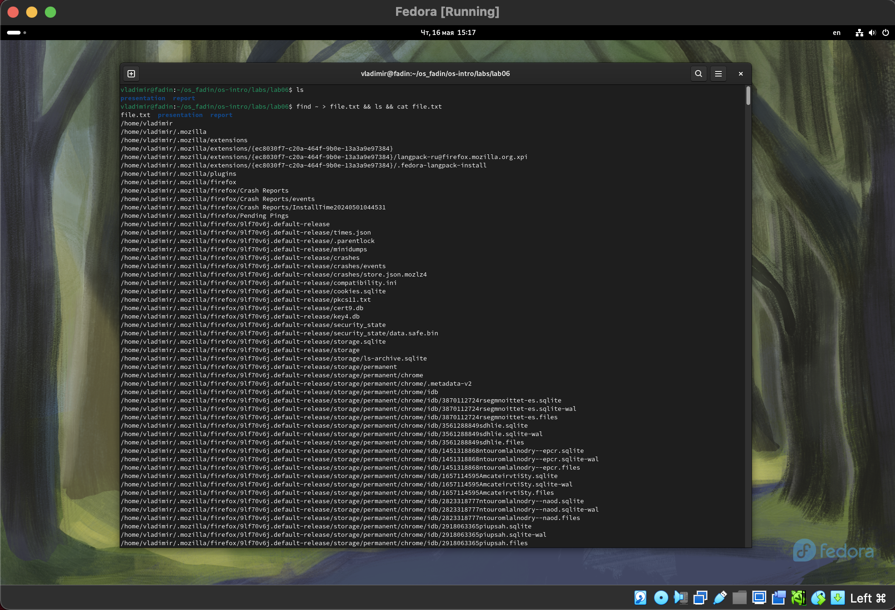
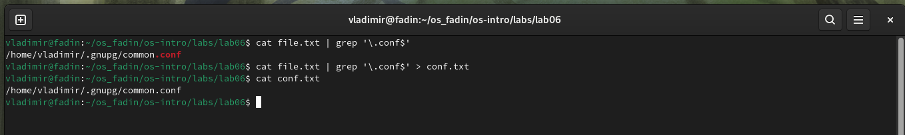
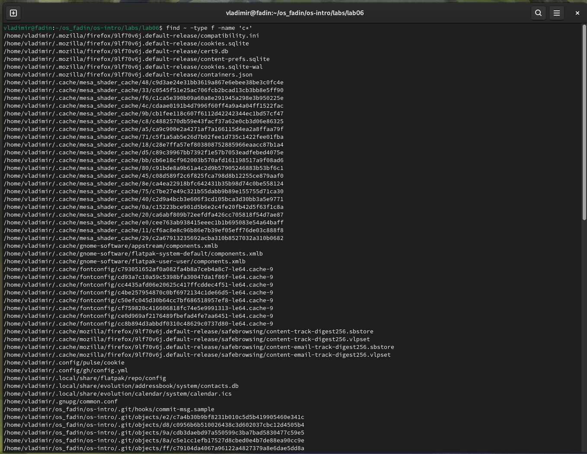
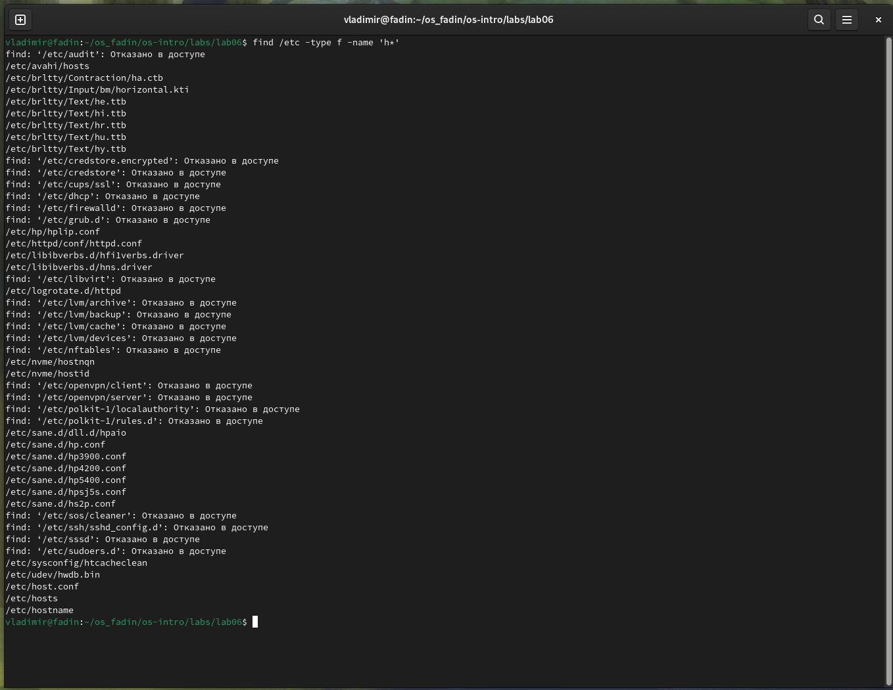
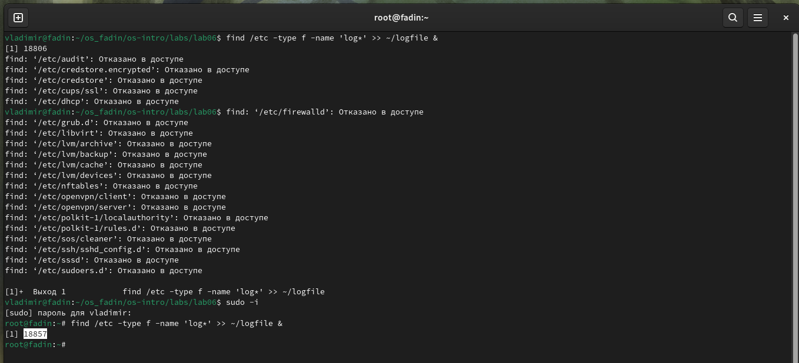
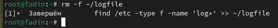
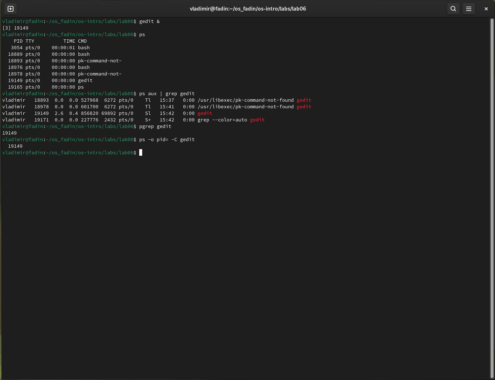
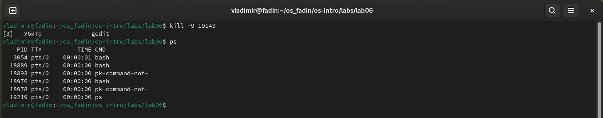
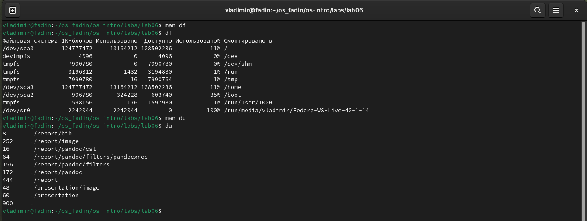
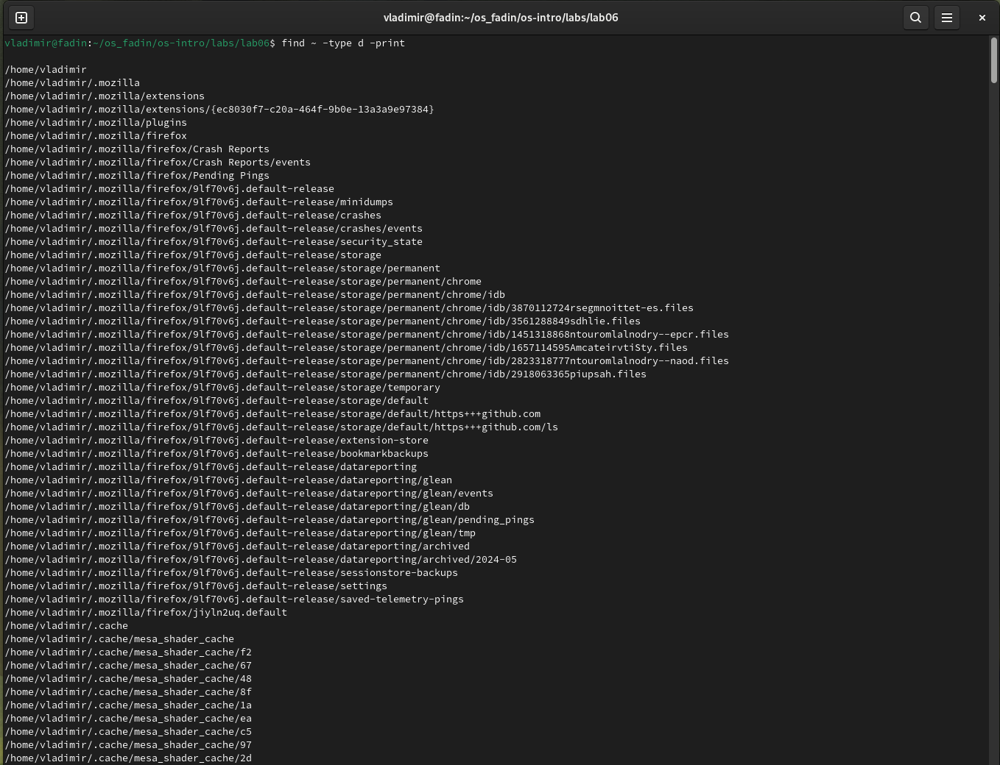

---
## Front matter
title: "Отчет по лабораторной работе №6"
subtitle: "Операционные системы"
author: "Фадин В.В."

## Generic otions
lang: ru-RU
toc-title: "Содержание"

## Bibliography
bibliography: bib/cite.bib
csl: pandoc/csl/gost-r-7-0-5-2008-numeric.csl

## Pdf output format
toc: true # Table of contents
toc-depth: 2
lof: true # List of figures
lot: true # List of tables
fontsize: 12pt
linestretch: 1.5
papersize: a4
documentclass: scrreprt
## I18n polyglossia
polyglossia-lang:
  name: russian
  options:
	- spelling=modern
	- babelshorthands=true
polyglossia-otherlangs:
  name: english
## I18n babel
babel-lang: russian
babel-otherlangs: english
## Fonts
mainfont: PT Serif
romanfont: PT Serif
sansfont: PT Sans
monofont: PT Mono
mainfontoptions: Ligatures=TeX
romanfontoptions: Ligatures=TeX
sansfontoptions: Ligatures=TeX,Scale=MatchLowercase
monofontoptions: Scale=MatchLowercase,Scale=0.9
## Biblatex
biblatex: true
biblio-style: "gost-numeric"
biblatexoptions:
  - parentracker=true
  - backend=biber
  - hyperref=auto
  - language=auto
  - autolang=other*
  - citestyle=gost-numeric
## Pandoc-crossref LaTeX customization
figureTitle: "Рис."
tableTitle: "Таблица"
listingTitle: "Листинг"
lofTitle: "Список иллюстраций"
lotTitle: "Список таблиц"
lolTitle: "Листинги"
## Misc options
indent: true
header-includes:
  - \usepackage{indentfirst}
  - \usepackage{float} # keep figures where there are in the text
  - \floatplacement{figure}{H} # keep figures where there are in the text
---

# Цель работы

Ознакомление с инструментами поиска файлов и фильтрации текстовых данных. Приобретение практических навыков: по управлению процессами (и заданиями), по
проверке использования диска и обслуживанию файловых систем.

# Выполнение лабораторной работы

Запишем в файл file.txt названия файлов, содержащихся в каталоге /etc. Допишем в этот же файл названия файлов, содержащихся в домашнем каталоге.

{#fig:001 width=70%}

Выведем имена всех файлов из file.txt, имеющих расширение .conf, после чего запишем их в новый текстовый файл conf.txt.

{#fig:002 width=70%}

Определим, какие файлы в домашнем каталоге имеют имена, начинающиеся с символа c.

{#fig:003 width=70%}

Выведем на экран (по странично) имена файлов из каталога /etc, начинающиеся с символа h.

{#fig:004 width=70%}

Запустим в фоновом режиме процесс, который будет записывать в файл ~/logfile файлы, имена которых начинаются с log.

{#fig:005 width=70%}

Удалим файл ~/logfile.

{#fig:006 width=70%}

Запустим из консоли в фоновом режиме редактор gedit.
Определим идентификатор процесса gedit, используя команду ps, конвейер и фильтр grep. Используем также и другие способы.

{#fig:007 width=70%}

Посмотрим справку (man) команды kill, после чего используем её для завершения процесса gedit.

{#fig:008 width=70%}

Выполним команды df и du, предварительно получив более подробную информацию об этих командах, с помощью команды man.

{#fig:009 width=70%}

Воспользовавшись справкой команды find, выведем имена всех директорий, имеющихся в домашнем каталоге.

{#fig:010 width=70%}

# Выводы

В данной лабораторной работе мы ознакомились с инструментами поиска файлов и фильтрации текстовых данных. Приобрели практические навыки: по управлению процессами (и заданиями), по проверке использования диска и обслуживанию файловых систем.

# Ответы на онтрольные вопросы

Вот ответы на ваши вопросы:

1. В Linux существует три стандартных потока: **stdin** (стандартный ввод), **stdout** (стандартный вывод) и **stderr** (стандартный вывод ошибок).
2. Оператор `>` перенаправляет вывод в файл, перезаписывая существующее содержимое. Оператор `>>` добавляет вывод в файл, сохраняя существующее содержимое.
3. **конвейер** (или **конвейер**) — это механизм соединения вывода одной команды с входом другой команды, позволяющий создавать сложные цепочки команд.
4. **Процесс** — это выполняющийся экземпляр программы, включая текущую активность, память и выделенные для него системные ресурсы. **Программа** — это набор инструкций, которые может выполнять компьютер, тогда как **процесс** — это фактическое выполнение этой программы.
5. **PID** (идентификатор процесса) — это уникальный идентификатор, присваиваемый каждому процессу операционной системой. **GID** (идентификатор группы) – это уникальный идентификатор, присваиваемый операционной системой каждой группе пользователей.
6. **Задачи** относятся к процессам или потокам, которые выполняются операционной системой. Команда «jobs» позволяет вам управлять задачами, например перечислять их, останавливать или возобновлять.
7. **top** и **htop** — это инструменты мониторинга системы, которые в режиме реального времени отображают информацию о запущенных процессах, системных ресурсах и показателях производительности. Они позволяют отслеживать и управлять активностью системы.
8. Команда «найти» используется для поиска файлов по различным критериям, таким как имя, размер, время изменения и разрешения. Например, команда find ~ -name 'file.txt' ищет файл с именем file.txt в домашнем каталоге.
9. Да, вы можете искать файлы по их содержимому, используя команду grep. Например, `grep -r 'search_term' ~` ищет строку `search_term` во всех файлах в домашнем каталоге и его подкаталогах.
10. Определить объем свободного места на диске можно с помощью команды `df`. Например, `df -h ~` отображает свободное дисковое пространство в домашнем каталоге в удобочитаемом формате.
11. Вы можете определить размер вашего домашнего каталога с помощью команды du. Например, `du -sh ~` отображает общий размер домашнего каталога в удобочитаемом формате.
12. Вы можете использовать команду kill для завершения процесса. Например, `kill 19149` завершает процесс с идентификатором 19149. Если процесс не отвечает на сигнал по умолчанию, вы можете использовать `kill -9 19149` для принудительного завершения.

