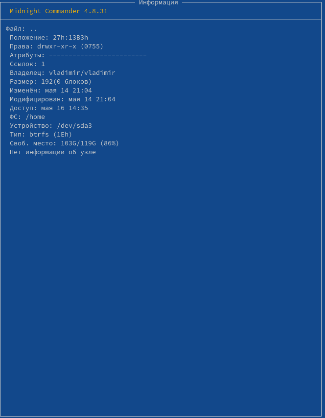

---
## Front matter
title: "Отчет по лабораторной работе №7"
subtitle: "Операционные системы"
author: "Фадин В.В."

## Generic otions
lang: ru-RU
toc-title: "Содержание"

## Bibliography
bibliography: bib/cite.bib
csl: pandoc/csl/gost-r-7-0-5-2008-numeric.csl

## Pdf output format
toc: true # Table of contents
toc-depth: 2
lof: true # List of figures
lot: true # List of tables
fontsize: 12pt
linestretch: 1.5
papersize: a4
documentclass: scrreprt
## I18n polyglossia
polyglossia-lang:
  name: russian
  options:
	- spelling=modern
	- babelshorthands=true
polyglossia-otherlangs:
  name: english
## I18n babel
babel-lang: russian
babel-otherlangs: english
## Fonts
mainfont: PT Serif
romanfont: PT Serif
sansfont: PT Sans
monofont: PT Mono
mainfontoptions: Ligatures=TeX
romanfontoptions: Ligatures=TeX
sansfontoptions: Ligatures=TeX,Scale=MatchLowercase
monofontoptions: Scale=MatchLowercase,Scale=0.9
## Biblatex
biblatex: true
biblio-style: "gost-numeric"
biblatexoptions:
  - parentracker=true
  - backend=biber
  - hyperref=auto
  - language=auto
  - autolang=other*
  - citestyle=gost-numeric
## Pandoc-crossref LaTeX customization
figureTitle: "Рис."
tableTitle: "Таблица"
listingTitle: "Листинг"
lofTitle: "Список иллюстраций"
lotTitle: "Список таблиц"
lolTitle: "Листинги"
## Misc options
indent: true
header-includes:
  - \usepackage{indentfirst}
  - \usepackage{float} # keep figures where there are in the text
  - \floatplacement{figure}{H} # keep figures where there are in the text
---

# Цель работы

Освоение основных возможностей командной оболочки Midnight Commander. Приобретение навыков практической работы по просмотру каталогов и файлов; манипуляций
с ними.

# Выполнение лабораторной работы

## Задание по mc

Изучим информацию о mc, вызвав в командной строке man mc.

{#fig:006 width=70%}

Запустим из командной строки mc, изучите его структуру и меню.

Выполним несколько операций в mc, используя управляющие клавиши (операции с панелями; выделение/отмена выделения файлов, копирование/перемещение файлов, получение информации о размере и правах доступа на файлы и/или каталоги и т.п.)

{#fig:007 width=70%}

Выполним основные команды меню левой (или правой) панели.

{#fig:008 width=70%}

Используя возможности подменю Файл, выполним:
– просмотр содержимого текстового файла;
– редактирование содержимого текстового файла (без сохранения результатов редактирования);
– создание каталога;
– копирование в файлов в созданный каталог.

{#fig:009 width=70%}

С помощью соответствующих средств подменю Команда осуществите:
– поиск в файловой системе файла с заданными условиями (например, файла с расширением .c или .cpp, содержащего строку main);
– выбор и повторение одной из предыдущих команд;
– переход в домашний каталог;
– анализ файла меню и файла расширений.

Вызовем подменю Настройки. Освоим операции, определяющие структуру экрана mc (Full screen, Double Width, Show Hidden Files и т.д.)ю

{#fig:010 width=70%}

## Задание по встроенному редактору mc

Создадим текстовой файл text.txt

{#fig:001 width=70%}

Откроем этот файл с помощью встроенного в mc редактора и вставим в открытый файл небольшой фрагмент текста, скопированный из любого другого файла или Интернета.

{#fig:002 width=70%}

Проделаем с текстом следующие манипуляции, используя горячие клавиши:
- Удалим строку текста.
- Выделим фрагмент текста и скопируем его на новую строку.
- Выделим фрагмент текста и перенесем его на новую строку.
- Сохраним файл.
- Отменим последнее действие.
- Перейдем в конец файла (нажав комбинацию клавиш) и напишем некоторый текст.
- Перейдем в начало файла (нажав комбинацию клавиш) и напишем некоторый текст.
- Сохраним и закроем файл.

{#fig:003 width=70%}

Откроем файл с исходным текстом на языке программирования Javascript

{#fig:004 width=70%}

Используя меню редактора, включим и выключим подсветку синтаксиса с помощью комбинации клавишь `CTRL+S`

{#fig:005 width=70%}

# Выводы

Мы освоили основные возможности командной оболочки Midnight Commander. Приобрили навыки практической работы по просмотру каталогов и файлов; манипуляций с ними.

# Ответы на онтрольные вопросы

### 1. Режимы работы в mc

Midnight Commander (MC) имеет несколько режимов работы:

* **Режим управления файлами**: это режим по умолчанию, в котором вы можете перемещаться по каталогам, выбирать файлы и выполнять над ними различные операции.
* **Режим редактора**: этот режим позволяет редактировать файлы с помощью встроенного или внешнего редактора по вашему выбору.
* **Командный режим**: этот режим позволяет выполнять команды оболочки непосредственно из mc.
* **Режим меню**: этот режим обеспечивает доступ к различным меню, таким как меню «Файл», меню «Правка», меню «Команды» и меню «Параметры», которые предлагают ряд команд и параметров для работы с файлами и настройки mc.

### 2. Операции с файлами в mc

Вы можете выполнять различные файловые операции в mc, используя как команды оболочки, так и ярлыки меню. Вот некоторые примеры:

* **Копирование файлов**. Вы можете копировать файлы, используя клавишу `F5` или выбрав «Копировать» в меню «Файл».
* **Перемещение файлов**. Вы можете перемещать файлы, используя клавишу `F6` или выбрав «Переместить» в меню «Файл».
* **Удаление файлов**: Вы можете удалить файлы, используя клавишу `F8` или выбрав «Удалить» в меню «Файл».
* **Создание каталогов**. Вы можете создавать каталоги, используя клавишу `F7` или выбрав «Создать каталог» в меню «Файл».
* **Редактирование файлов**. Вы можете редактировать файлы, используя клавишу `F4` или выбрав «Редактировать» в меню «Файл».

### 3. Структура меню левой (или правой) панели mc

Левая и правая панели в mc отображают иерархию файловой системы. Перемещаться по каталогам можно с помощью клавиш со стрелками, клавиши Enter или щелчков мыши. Панели также обеспечивают доступ к различным меню и командам, таким как:

* **Меню «Файл»**: доступное по нажатию клавиши «F9». Это меню предлагает такие операции, как изменение разрешений, связывание и создание символических ссылок.
* **Меню команд**: доступное по нажатию клавиши «F2». Это меню предлагает такие команды, как сравнение каталогов, поиск файлов и редактирование файла меню.

### 4. Структура меню Файл mc

Меню «Файл» в mc предлагает различные операции по работе с файлами, в том числе:

* **Копировать**: копирует выбранный файл или каталог.
* **Переместить**: перемещает выбранный файл или каталог.
* **Удалить**: удаляет выбранный файл или каталог.
* **Редактировать**: редактирует выбранный файл с помощью встроенного или внешнего редактора.
* **Просмотр**: просмотр содержимого выбранного файла.

### 5. Структура меню Команда mc

Меню «Команды» в mc предлагает различные команды для работы с файлами и каталогами, в том числе:

* **Сравнить каталоги**: сравнивает содержимое двух каталогов.
* **Найти файл**: поиск файлов по различным критериям.
* **Редактировать файл меню**: редактирует файл меню для настройки меню mc.

### 6. Структура меню Настройки mc

Меню «Параметры» в mc позволяет настраивать различные аспекты mc, в том числе:

* **Макет**: настройка макета интерфейса mc.
* **Дисплей**: настройка отображения информации о файле.
* **Редактор**: настройка редактора, используемого для редактирования файлов.
* **Разное**: настраивает различные другие аспекты mc.

### 7. Встроенные команды mc

Midnight Commander (mc) имеет несколько встроенных команд, в том числе:

* **cd**: Изменяет текущий каталог.
* **mkdir**: Создает новый каталог.
* **rm**: удаляет файлы или каталоги.
* **cp**: копирует файлы или каталоги.
* **mv**: перемещает файлы или каталоги.

### 8. Команды встроенного редактора mc

Встроенный редактор mc предлагает различные команды для редактирования файлов, в том числе:

* **F2**: сохраняет файл.
* **F3**: поиск текста в файле.
* **F4**: Заменяет текст в файле.
* **F5**: переход к определенному номеру строки в файле.
* **F6**: вставляет содержимое другого файла в текущий файл.

### 9. Средства mc для создания меню, определяемые пользователем

Midnight Commander (mc) позволяет создавать собственные меню с помощью команды «меню». Вы можете определить свои собственные меню и добавлять к ним команды, используя команду `menu`.

### 10. Средства mc для выполнения действий, определяемые пользователем, над текущим файлом

Midnight Commander (mc) позволяет выполнять пользовательские команды к текущему файлу с помощью меню «Команды». Вы можете определить свои собственные команды и добавить их в меню «Команды» с помощью команды «Меню».
