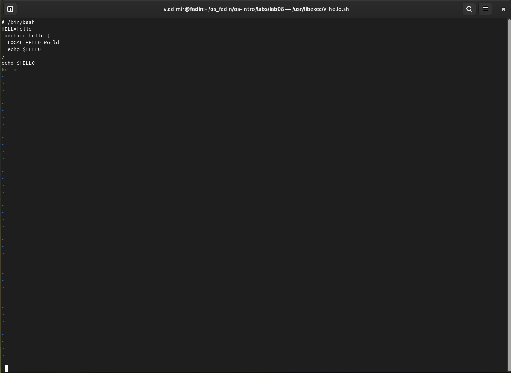
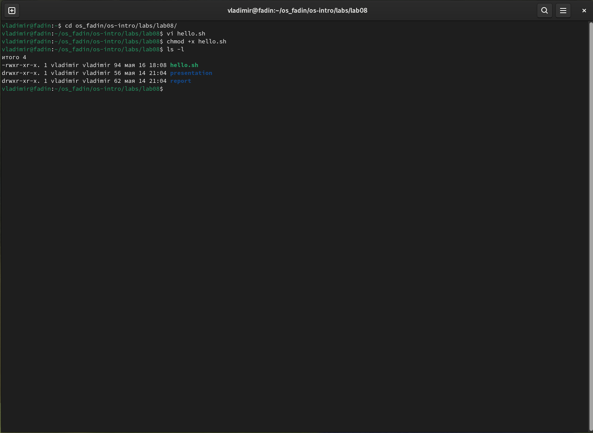
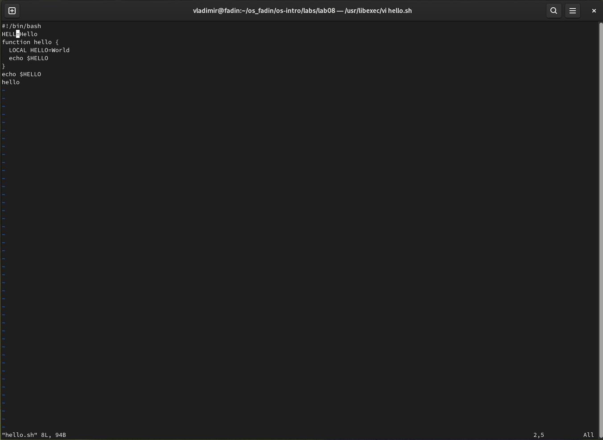
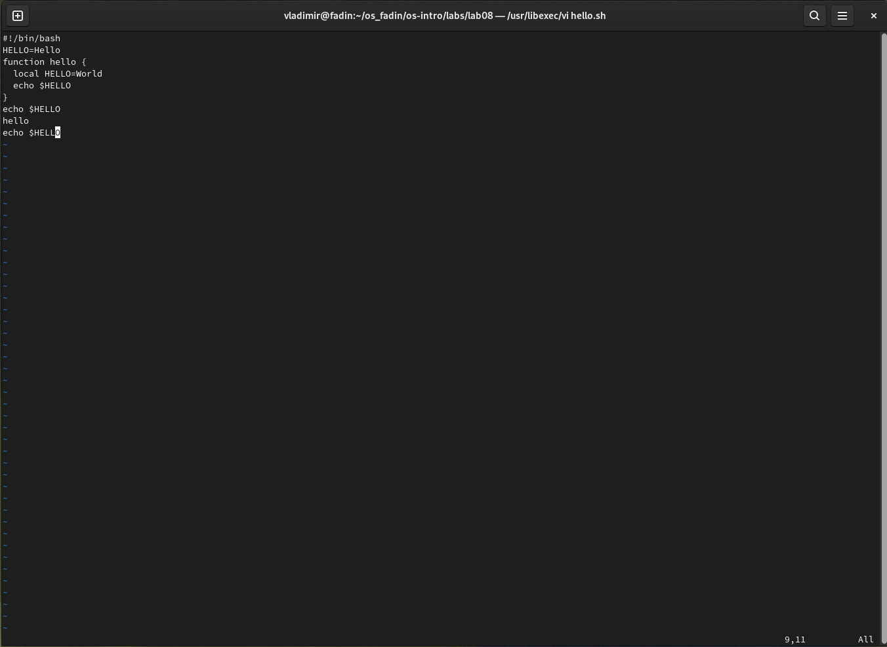

---
## Front matter
title: "Отчет по лабораторной работе №8"
subtitle: "Операционные системы"
author: "Фадин В.В."

## Generic otions
lang: ru-RU
toc-title: "Содержание"

## Bibliography
bibliography: bib/cite.bib
csl: pandoc/csl/gost-r-7-0-5-2008-numeric.csl

## Pdf output format
toc: true # Table of contents
toc-depth: 2
lof: true # List of figures
lot: true # List of tables
fontsize: 12pt
linestretch: 1.5
papersize: a4
documentclass: scrreprt
## I18n polyglossia
polyglossia-lang:
  name: russian
  options:
	- spelling=modern
	- babelshorthands=true
polyglossia-otherlangs:
  name: english
## I18n babel
babel-lang: russian
babel-otherlangs: english
## Fonts
mainfont: PT Serif
romanfont: PT Serif
sansfont: PT Sans
monofont: PT Mono
mainfontoptions: Ligatures=TeX
romanfontoptions: Ligatures=TeX
sansfontoptions: Ligatures=TeX,Scale=MatchLowercase
monofontoptions: Scale=MatchLowercase,Scale=0.9
## Biblatex
biblatex: true
biblio-style: "gost-numeric"
biblatexoptions:
  - parentracker=true
  - backend=biber
  - hyperref=auto
  - language=auto
  - autolang=other*
  - citestyle=gost-numeric
## Pandoc-crossref LaTeX customization
figureTitle: "Рис."
tableTitle: "Таблица"
listingTitle: "Листинг"
lofTitle: "Список иллюстраций"
lotTitle: "Список таблиц"
lolTitle: "Листинги"
## Misc options
indent: true
header-includes:
  - \usepackage{indentfirst}
  - \usepackage{float} # keep figures where there are in the text
  - \floatplacement{figure}{H} # keep figures where there are in the text
---

# Цель работы

Познакомиться с операционной системой Linux. Получить практические навыки работы с редактором vi, установленным по умолчанию практически во всех дистрибутивах.

# Выполнение лабораторной работы

## Задание 1. Создание нового файла с использованием vi

Перейдем в каталог с именем `~os_fadin/os-intro/labs/lab08/`.

Вызовем vi и создайте файл hello.sh, также введем текст скрипта.

{#fig:001 width=70%}

Нажмем клавишу `Esc` для перехода в командный режим после завершения ввода текста. Затем нажмем `:` для перехода в режим последней строки и внизу экрана появилась приглашение в виде двоеточия.

{#fig:002 width=70%}

Нажмем `w` (записать) и `q` (выйти), а затем нажмем клавишу `Enter` для сохранения текста и завершения работы.

Сделаем файл исполняемым.

{#fig:003 width=70%}

##  Задание 2. Редактирование существующего файла

Вызовем `vi` на редактирование файла `hello.sh` и установим курсор в конец слова `HELL` второй строки.

{#fig:004 width=70%}

Перейдем в режим вставки и заменим на `HELLO`. Нажмем `Esc` для возврата в командный режим. Затем установим курсор на четвертую строку и сотрем слово `LOCAL`. После чего перейдем в режим вставки и наберем следующий текст: `local`, нажмем `Esc` для возврата в командный режим.

{#fig:005 width=70%}

Установим курсор на последней строке файла. Вставим после неё строку, содержащую следующий текст: `echo $HELLO`. Затем нажмем `Esc` для перехода в командный режим.

{#fig:006 width=70%}

Удалим последнюю строку.

{#fig:007 width=70%}

Введем команду отмены изменений `u` для отмены последней команды.

{#fig:008 width=70%}

Введем символ `:` для перехода в режим последней строки. Запишем произведённые изменения и выйдите из `vi`.

# Выводы

Познакомились с операционной системой Linux. Получили практические навыки работы с редактором vi.

# Ответы на онтрольные вопросы

### 1. Режимы работы редактора vi

Редактор vi имеет несколько режимов работы:

* **Командный режим**: это режим по умолчанию, в котором вы можете вводить команды для навигации, редактирования и управления текстом.
* **Режим вставки**: этот режим позволяет вставлять текст в файл.
* **Режим строки**: этот режим позволяет редактировать одну строку текста.

### 2. Выход из редактора, не сохраняя произведённые изменения.

Чтобы выйти из редактора vi без сохранения изменений, нажмите `:q`, а затем `Enter`.

### 3. Команды сказок

Некоторые распространенные команды позиционирования в vi включают:

* `h`: перемещает курсор влево.
* `j`: перемещает курсор вниз.
* `k`: перемещает курсор вверх.
* `l`: перемещает курсор вправо.
* `w`: перемещает курсор в начало следующего слова.
* `b`: перемещает курсор в начало предыдущего слова.
* `0`: перемещает курсор в начало строки.
* `$`: перемещает курсор в конец строки.

### 4. Слово в редакторе vi

В vi слово представляет собой последовательность буквенно-цифровых символов, разделенных пробелами или знаками препинания.

## начало# 5. Переход в (конец) файла

Чтобы перейти к началу файла, нажмите `gg`. Чтобы перейти к концу файла, нажмите «G».

### 6. Основные группы команд редактирования

Некоторые основные команды редактирования в vi включают:

* `i`: переход в режим вставки.
* `a`: переход в режим вставки после курсора.
* `o`: открывает новую строку под курсором и переходит в режим вставки.
* `dw`: удаляет слово под курсором.
* `dd`: Удаляет строку под курсором.
* `p`: вставляет содержимое буфера обмена после курсора.

### 7. Заполнение строк символами $

Чтобы заполнить строку символами `$`, нажмите `esc` для входа в командный режим, затем введите `:$r$` и нажмите `Enter`.

### 8. Отмена некорректного действия

Чтобы отменить неправильное действие, нажмите «u» в командном режиме.

### 9. Основная группа управления верхних строк.

Некоторые распространенные команды в режиме последней строки (также известном как режим ex) включают:

* `:w`: Сохраняет файл.
* `:q`: Выход из редактора.
* `:q`: Закрывает редактор без сохранения изменений.
* `:wq`: сохраняет файл и закрывает редактор.

### 10. Определение позиции, в которой заканчивается строка

Чтобы определить позицию, где заканчивается строка, не перемещая курсор, нажмите «esc» для входа в командный режим, затем введите «:$» и нажмите «Enter». Это отобразит номер строки и номер столбца конца строки.

### 11. Анализ опций редактора vi

Vi имеет множество опций, которые можно настроить для настройки его поведения. Эти параметры можно установить с помощью команды `:set` в режиме ex. Например, `:set nu` устанавливает нумерацию строк, а `:set ai` устанавливает автоотступ.

### 12. Определение режима работы редактора vi

Чтобы определить текущий режим редактора vi, найдите индикатор режима внизу экрана. В командном режиме индикатор отобразит `--`, а в режиме вставки индикатор отобразит `-- INSERT --`.

### 13. Граф взаимосвязи периодов работы редактора vi

График режимов vi выглядит следующим образом:

* Командный режим > Режим вставки (с использованием `i`, `a` или `o`)
* Режим вставки > Режим команд (с помощью `esc`)
* Командный режим > Режим последней строки (с использованием `:`)
* Режим последней строки > Командный режим (с помощью Enter)

Обратите внимание, что этот график не является исчерпывающим, но показывает основные переходы между режимами в vi.
