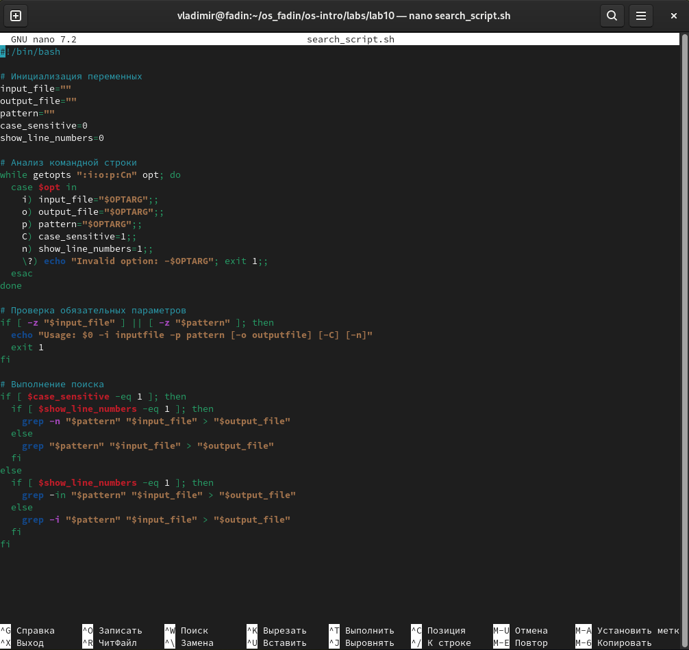
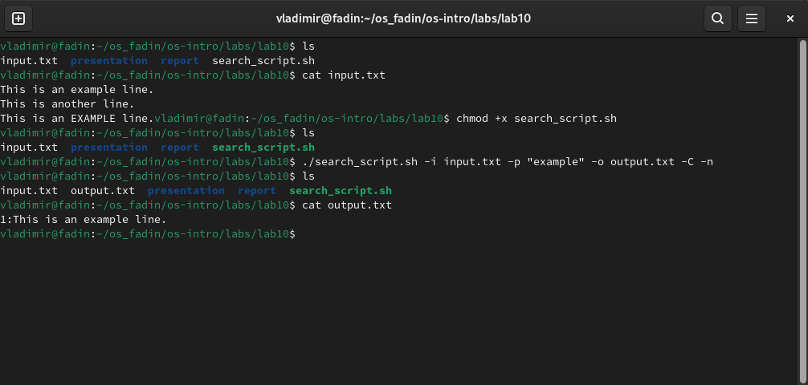
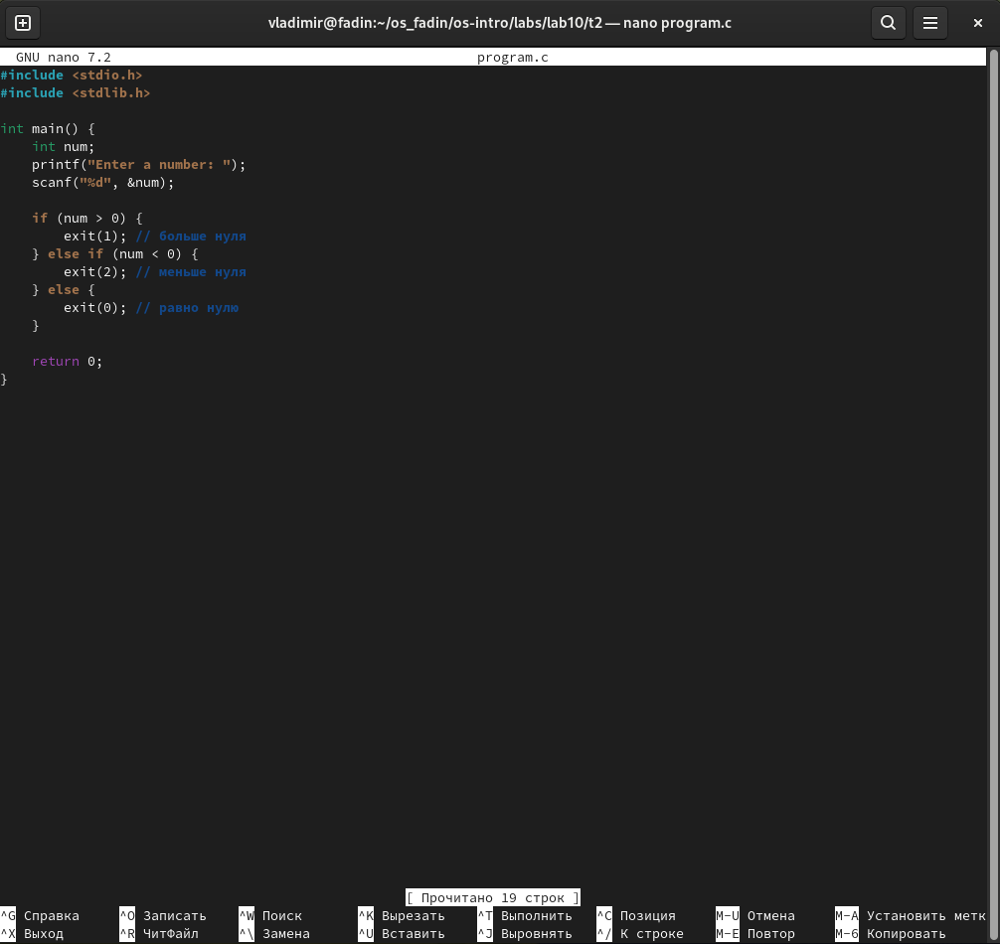
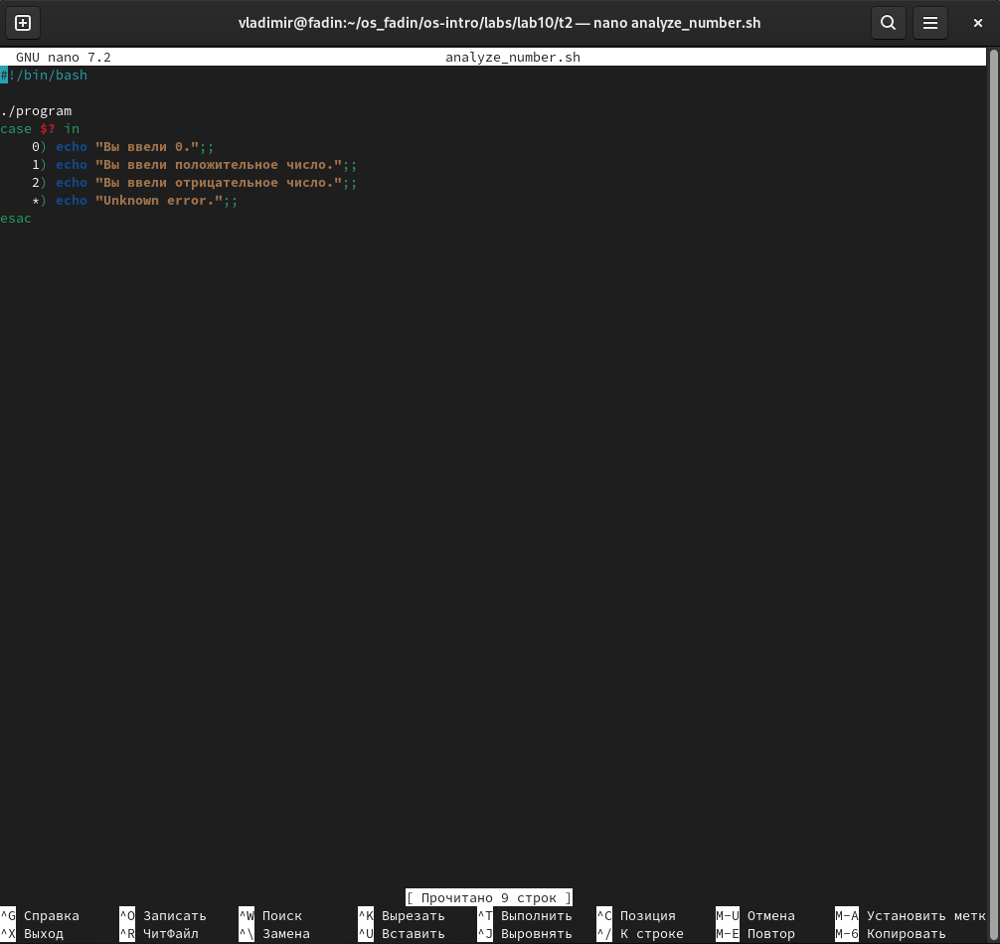
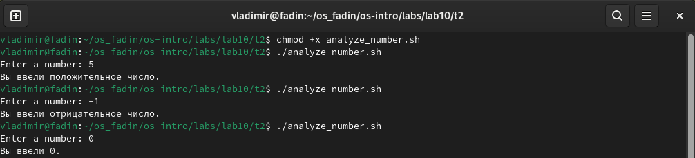
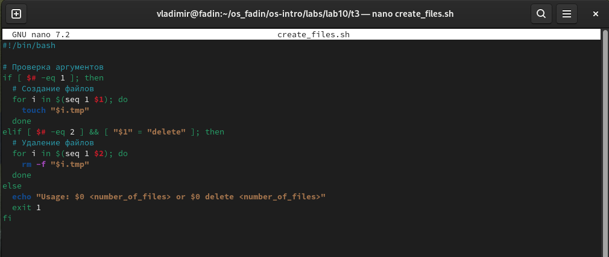
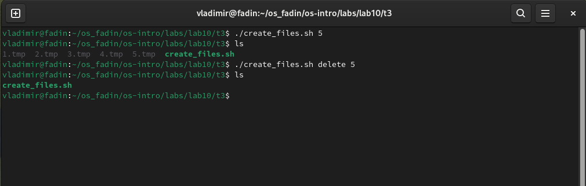
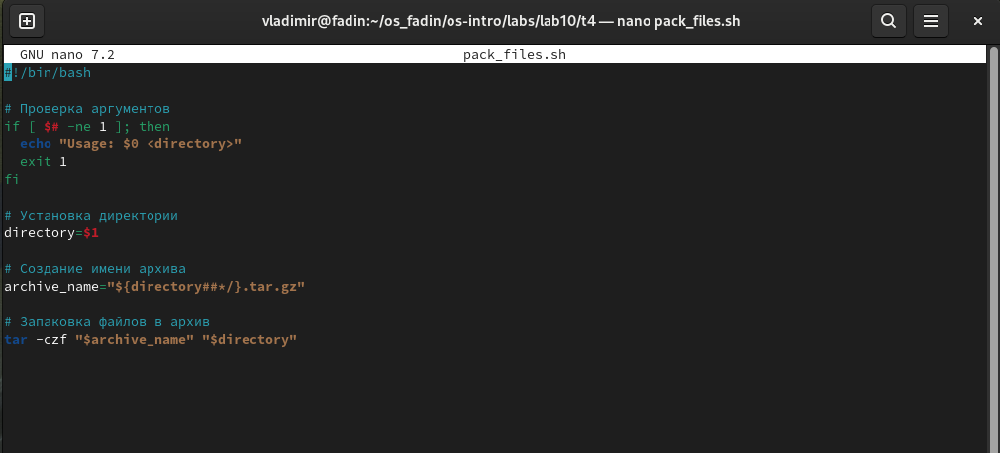
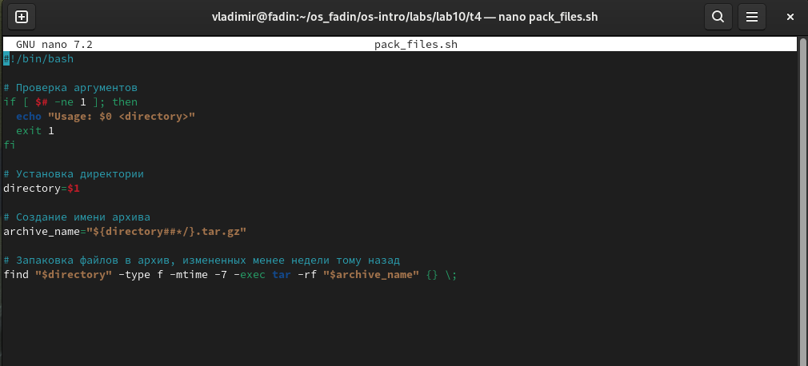
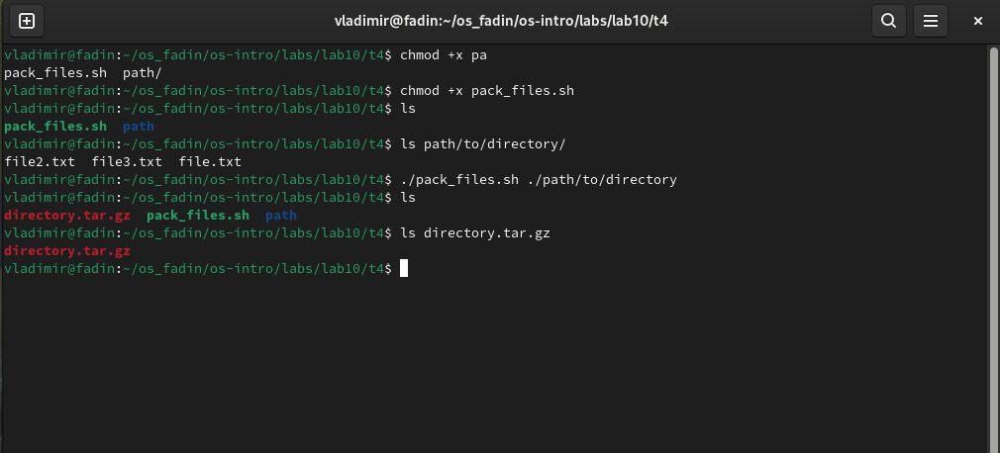

---
## Front matter
title: "Отчет по лабораторной работе №10"
subtitle: "Операционные системы"
author: "Фадин В.В."

## Generic otions
lang: ru-RU
toc-title: "Содержание"

## Bibliography
bibliography: bib/cite.bib
csl: pandoc/csl/gost-r-7-0-5-2008-numeric.csl

## Pdf output format
toc: true # Table of contents
toc-depth: 2
lof: true # List of figures
lot: true # List of tables
fontsize: 12pt
linestretch: 1.5
papersize: a4
documentclass: scrreprt
## I18n polyglossia
polyglossia-lang:
  name: russian
  options:
	- spelling=modern
	- babelshorthands=true
polyglossia-otherlangs:
  name: english
## I18n babel
babel-lang: russian
babel-otherlangs: english
## Fonts
mainfont: PT Serif
romanfont: PT Serif
sansfont: PT Sans
monofont: PT Mono
mainfontoptions: Ligatures=TeX
romanfontoptions: Ligatures=TeX
sansfontoptions: Ligatures=TeX,Scale=MatchLowercase
monofontoptions: Scale=MatchLowercase,Scale=0.9
## Biblatex
biblatex: true
biblio-style: "gost-numeric"
biblatexoptions:
  - parentracker=true
  - backend=biber
  - hyperref=auto
  - language=auto
  - autolang=other*
  - citestyle=gost-numeric
## Pandoc-crossref LaTeX customization
figureTitle: "Рис."
tableTitle: "Таблица"
listingTitle: "Листинг"
lofTitle: "Список иллюстраций"
lotTitle: "Список таблиц"
lolTitle: "Листинги"
## Misc options
indent: true
header-includes:
  - \usepackage{indentfirst}
  - \usepackage{float} # keep figures where there are in the text
  - \floatplacement{figure}{H} # keep figures where there are in the text
---

# Цель работы

Изучить основы программирования в оболочке ОС UNIX. Научится писать более сложные командные файлы с использованием логических управляющих конструкций и циклов.

# Выполнение лабораторной работы

## Задача 1

{#fig:001 width=70%}

В этом скрипте мы используем getopts для анализа командной строки и извлечения значений параметров. Затем мы проверяем, были ли указаны обязательные параметры -i и -p. Если они указаны, мы выполняем поиск с помощью grep, учитывая параметры -C и -n. Результат поиска выводится в файл, указанный параметром -o, если он был указан.

{#fig:002 width=70%}

## Задача 2

Вот пример программы на языке Си, которая вводит число и определяет, является ли оно больше нуля, меньше нуля или равно нулю:

{#fig:003 width=70%}

Далее компилируем программу:
```
gcc program.c -o program
```

Теперь создадим командный файл, который будет вызывать эту программу и анализировать код завершения:

{#fig:004 width=70%}

Сохраняем командный файл, например, как `analyze_number.sh`, и делаем его исполняемым:
```
chmod +x analyze_number.sh
```

Теперь мы можем запустить командный файл:

{#fig:005 width=70%}

Программа будет запрашивать ввод числа, и после ввода она будет завершаться с кодом, соответствующим типу введенного числа. Командный файл будет анализировать код завершения и выводить соответствующее сообщение.

## Задача 3

Вот пример командного файла, который создает указанное число файлов и может удалять их:

{#fig:006 width=70%}

Командный файл принимает один аргумент - количество файлов, которые нужно создать. Он использует цикл `for` с командой `seq` для создания файлов с именами от `1.tmp` до `<number_of_files>.tmp`.

Если аргументом является строка `"delete"`, то командный файл удаляет все созданные файлы, используя цикл `for` с командой `rm -f`.

Пример использования:

{#fig:007 width=70%}

В первом примере командный файл создает 5 файлов с именами `1.tmp`, `2.tmp`, ..., `5.tmp`. Во втором примере он удаляет эти файлы, если они существуют.

## Задача 4

Вот пример командного файла, который запаковывает в архив все файлы в указанной директории:

{#fig:008 width=70%}

Командный файл принимает один аргумент - путь к директории, которую нужно запаковать.

Чтобы модифицировать его, чтобы запаковывались только те файлы, которые были изменены менее недели тому назад, мы можем использовать команду `find`:

{#fig:009 width=70%}

В этом модифицированном командном файле мы используем команду `find` для поиска файлов в указанной директории, которые были изменены менее недели тому назад (`-mtime -7`). Затем мы используем опцию `-exec` для запуска команды `tar` с каждым найденным файлом, добавляя его в архив.

Пример использования:

{#fig:010 width=70%}

Командный файл создаст архив с именем `directory.tar.gz` в текущей директории, содержащий все файлы в указанной директории, которые были изменены менее недели тому назад.

# Выводы

Изучили основы программирования в оболочке ОС UNIX. Научится писать более сложные командные файлы с использованием логических управляющих конструкций и циклов.

# Ответы на контрольные вопросы

1. Команда `getopts` предназначена для парсинга параметров командной строки в shell-скриптах. Она позволяет извлекать и обрабатывать опции, передаваемые в скрипт, и их аргументы.

2. Метасимволы (`*`, `?`, `[`, `]`, `(`, `)`, `{`, `}`, `~`, `.`) используются в Linux для генерации имён файлов, известной как globbing. Они позволяют указать шаблоны для поиска файлов, что может быть полезно при выполнении различных операций с файлами, таких как поиск, удаление, копирование и т.д.

3. Операторы управления действиями в Linux включают в себя:
   - `&&` (логическое И) - выполняет вторую команду только если первая команда выполнена успешно.
   - `||` (логическое ИЛИ) - выполняет вторую команду только если первая команда не выполнена успешно.
   - `;` (точка с запятой) - разделяет команды, которые выполняются последовательно.
   - `&` (амперсанд) - запускает команду в фоне.
   - `|` (вертикальная черта) - перенаправляет вывод одной команды на вход другой.

4. Операторы, используемые для прерывания цикла, включают в себя:
   - `break` - прерывает выполнение цикла и продолжает выполнение скрипта после цикла.
   - `continue` - прерывает текущую итерацию цикла и продолжает выполнение с следующей итерации.

5. Команды `false` и `true` используются для возвращения определенного статуса выполнения. `true` всегда возвращает 0 (успешное выполнение), а `false` всегда возвращает 1 (неуспешное выполнение). Они могут быть полезны в скриптах для управления потоком выполнения в зависимости от результатов предыдущих операций.

6. Строка `if test -f man$s/$i.$s` встреченная в командном файле, проверяет, существует ли файл с именем `$i.$s` в директории `man$s`. Если файл существует, то условие `if` будет истинным, иначе - ложным.

7. Конструкции `while` и `until` используются для создания циклов в shell-скриптах.
   - `while` - цикл будет продолжаться, пока условие является истинным.
   - `until` - цикл будет продолжаться, пока условие является ложным.
