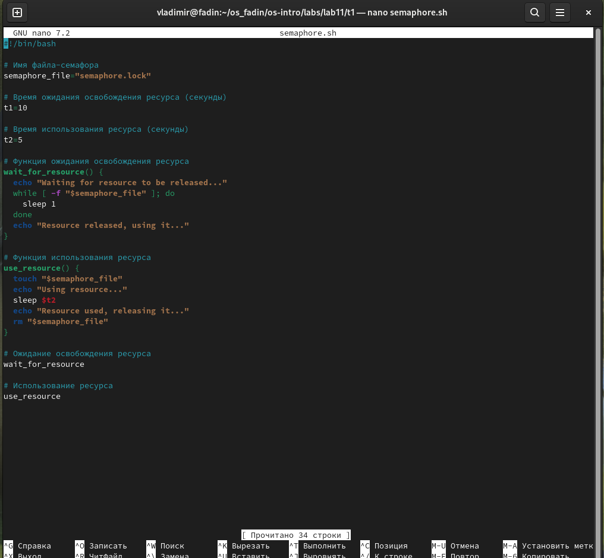
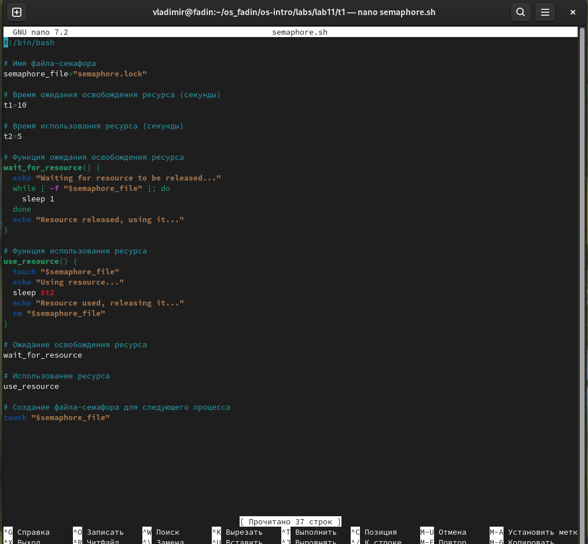
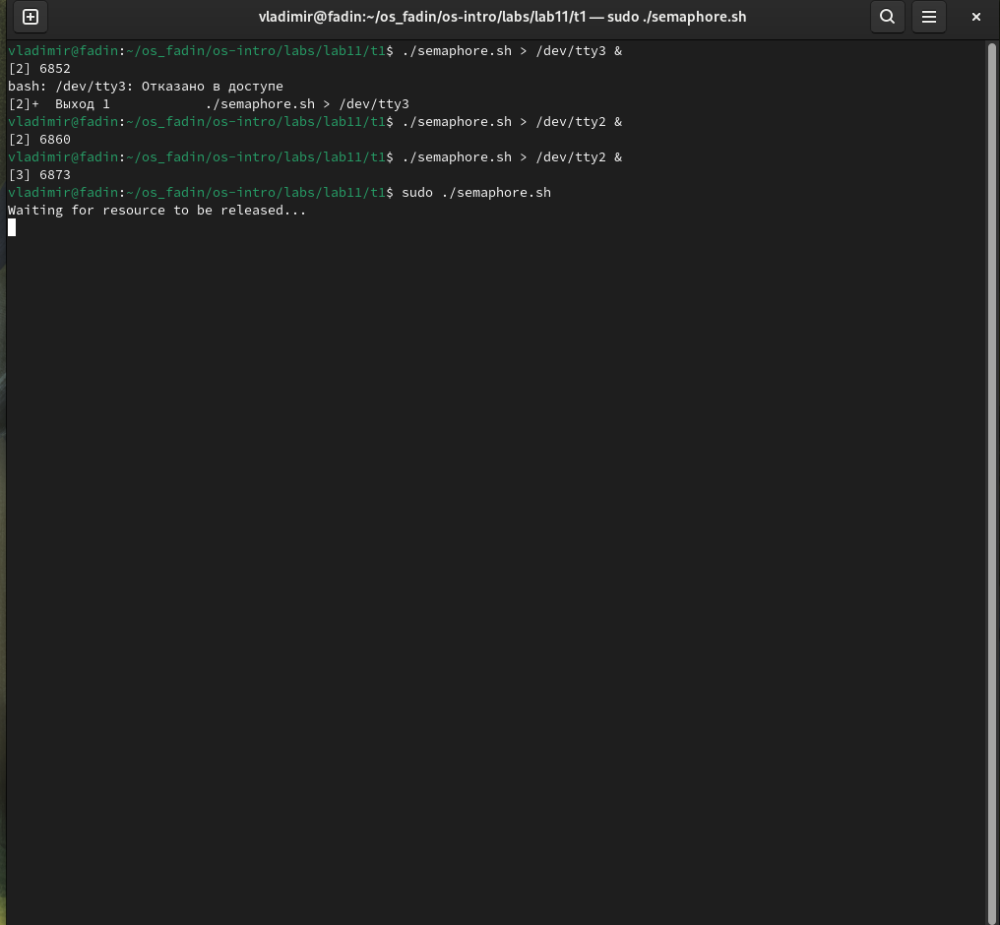
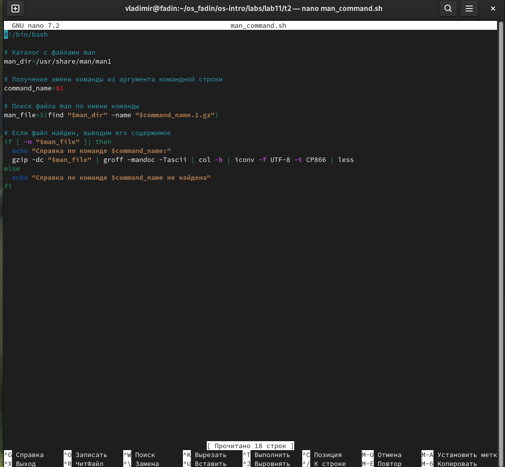
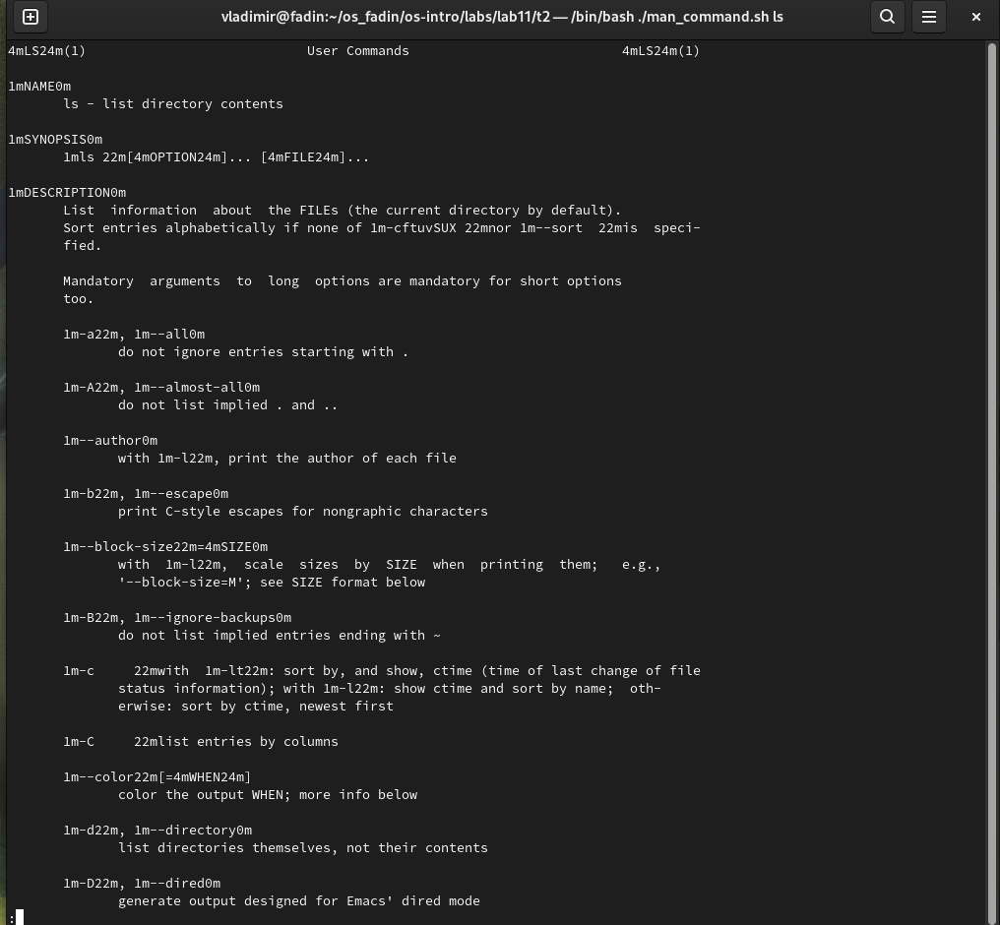

---
## Front matter
title: "Отчет по лабораторной работе №11"
subtitle: "Операционные системы"
author: "Фадин В.В."

## Generic otions
lang: ru-RU
toc-title: "Содержание"

## Bibliography
bibliography: bib/cite.bib
csl: pandoc/csl/gost-r-7-0-5-2008-numeric.csl

## Pdf output format
toc: true # Table of contents
toc-depth: 2
lof: true # List of figures
lot: true # List of tables
fontsize: 12pt
linestretch: 1.5
papersize: a4
documentclass: scrreprt
## I18n polyglossia
polyglossia-lang:
  name: russian
  options:
	- spelling=modern
	- babelshorthands=true
polyglossia-otherlangs:
  name: english
## I18n babel
babel-lang: russian
babel-otherlangs: english
## Fonts
mainfont: PT Serif
romanfont: PT Serif
sansfont: PT Sans
monofont: PT Mono
mainfontoptions: Ligatures=TeX
romanfontoptions: Ligatures=TeX
sansfontoptions: Ligatures=TeX,Scale=MatchLowercase
monofontoptions: Scale=MatchLowercase,Scale=0.9
## Biblatex
biblatex: true
biblio-style: "gost-numeric"
biblatexoptions:
  - parentracker=true
  - backend=biber
  - hyperref=auto
  - language=auto
  - autolang=other*
  - citestyle=gost-numeric
## Pandoc-crossref LaTeX customization
figureTitle: "Рис."
tableTitle: "Таблица"
listingTitle: "Листинг"
lofTitle: "Список иллюстраций"
lotTitle: "Список таблиц"
lolTitle: "Листинги"
## Misc options
indent: true
header-includes:
  - \usepackage{indentfirst}
  - \usepackage{float} # keep figures where there are in the text
  - \floatplacement{figure}{H} # keep figures where there are in the text
---

# Цель работы

Изучить основы программирования в оболочке ОС UNIX. Научиться писать более сложные командные файлы с использованием логических управляющих конструкций и циклов.

# Выполнение лабораторной работы

## Задача 1

Вот пример командного файла, реализующего упрощенный механизм семафоров:

{#fig:001 width=70%}

Командный файл создает файл-семафор semaphore.lock для синхронизации доступа к ресурсу. Функция wait_for_resource ожидает освобождения ресурса, проверяя наличие файла-семафора, и выводит сообщение о ожидании. Функция use_resource использует ресурс, выводит сообщение о его использовании, и после использования ресурса удаляет файл-семафор.

Чтобы запустить командный файл в привилегированном режиме, мы можем использовать следующую команду:

```bash
sudo ./semaphore.sh
```

Здесь мы запускаем командный файл с привилегиями суперпользователя (`sudo`).

Чтобы доработать программу для взаимодействия трех и более процессов, мы можем использовать следующий подход:

{#fig:002 width=70%}

В этом примере мы создаем файл-семафор после использования ресурса, чтобы следующий процесс мог ожидать его освобождения. Таким образом, мы можем запустить несколько процессов, которые будут ожидать освобождения ресурса и использовать его по очереди.

{#fig:003 width=70%}

Здесь мы запускаем три процесса, каждый из которых будет ожидать освобождения ресурса и использовать его по очереди.

## Задача 2

Командный файл, реализующий команду man:

{#fig:004 width=70%}

Командный файл получает в виде аргумента командной строки название команды и в виде результата выдает справку об этой команде или сообщение об отсутствии справки, если соответствующего файла нет в каталоге `man1`.

Пример использования:

{#fig:005 width=70%}

В этом примере командный файл будет искать файл `ls.1.gz` в каталоге `/usr/share/man/man1` и выводить его содержимое с помощью `less`, если файл найден. Если файл не найден, будет выдано сообщение об отсутствии справки.

Также видно, что в тексте присутствуют иероглифы. Решение устранения пока найти не удалось.

## Задача 3

Реализация скрипта:

{#fig:006 width=70%}

Этот скрипт генерирует случайную последовательность букв латинского алфавита, используя переменную `$RANDOM` для генерации случайного числа между 0 и 25, а затем используя команду `printf` для преобразования числа в букву латинского алфавита (A-Z). Функция `generate_random_letter` вызывается 10 раз для генерации последовательности из 10 случайных букв.

{#fig:007 width=70%}

# Выводы

Мы изучили основы программирования в оболочке ОС UNIX. Научились писать более сложные командные файлы с использованием логических управляющих конструкций и циклов.

# Ответы на онтрольные вопросы

Вот ответы на контрольные вопросы:

1. Синтаксическая ошибка в строке ` while [$1 != "exit"]` заключается в отсутствии пробелов между скобками и переменными/операторами. Это должно быть ` while [ "$1" != "exit" ]`.
2. Чтобы объединить несколько строк в одну, вы можете использовать следующий синтаксис: `result="${str1}${str2}${str3}"`.
3. Утилита `seq` генерирует последовательность чисел. Его можно заменить циклом for или использовать синтаксис {start..end}` в bash. Например, `for ((i=1; i<=10; i++)); сделать эхо $i; готово» или «эхо {1..10}».
4. Результатом выражения `$((10/3))` является `3`.
5. Основные различия между zsh и bash:
* `zsh` имеет более продвинутые функции завершения и подстановки.
* `zsh` имеет более мощный синтаксис для сценариев оболочки.
* `zsh` имеет лучшую поддержку Unicode и интернационализации.
* `zsh` имеет более настраиваемую подсказку.
6. Синтаксис `for ((a=1; a <= LIMIT; a++))` верен.
7. Bash часто сравнивают с другими языками сценариев, такими как Perl, Python и Ruby. Преимущество Bash заключается в тесной интеграции со средой командной строки Unix/Linux, что делает его мощным инструментом для задач системного администрирования и автоматизации. Однако ему может не хватать некоторых функций и гибкости языков программирования более общего назначения.
