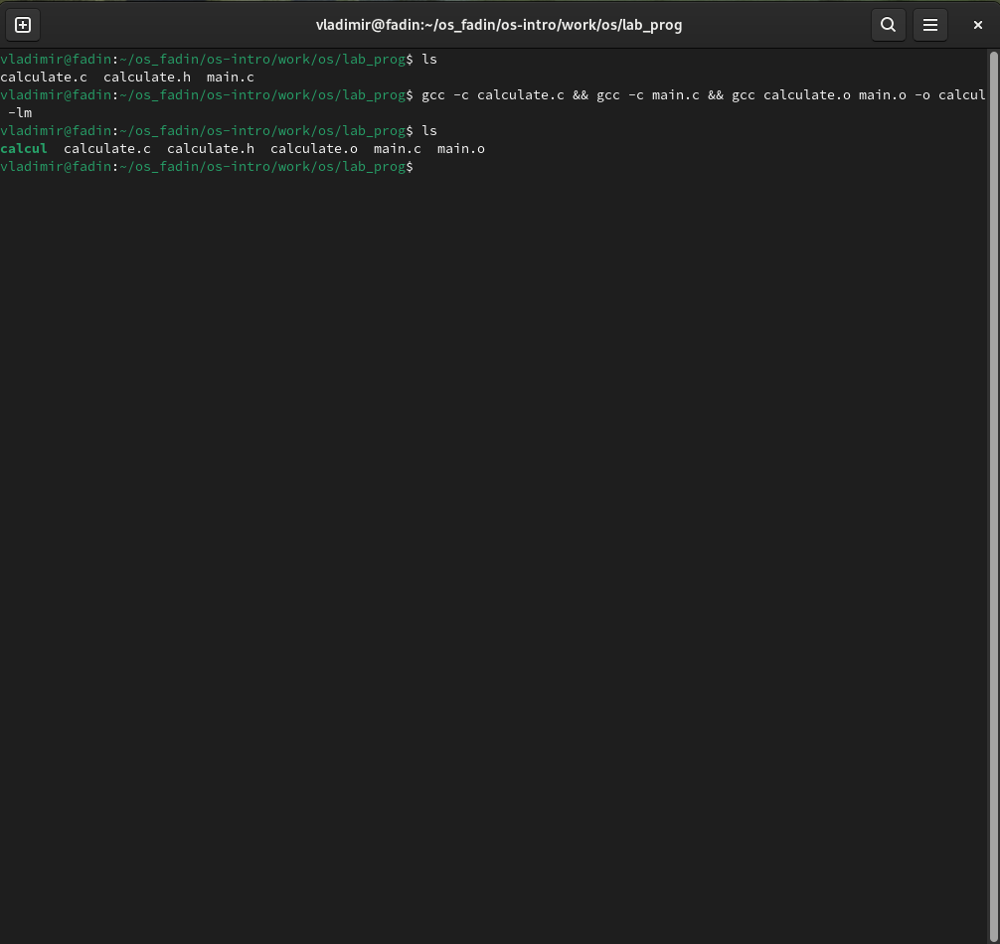
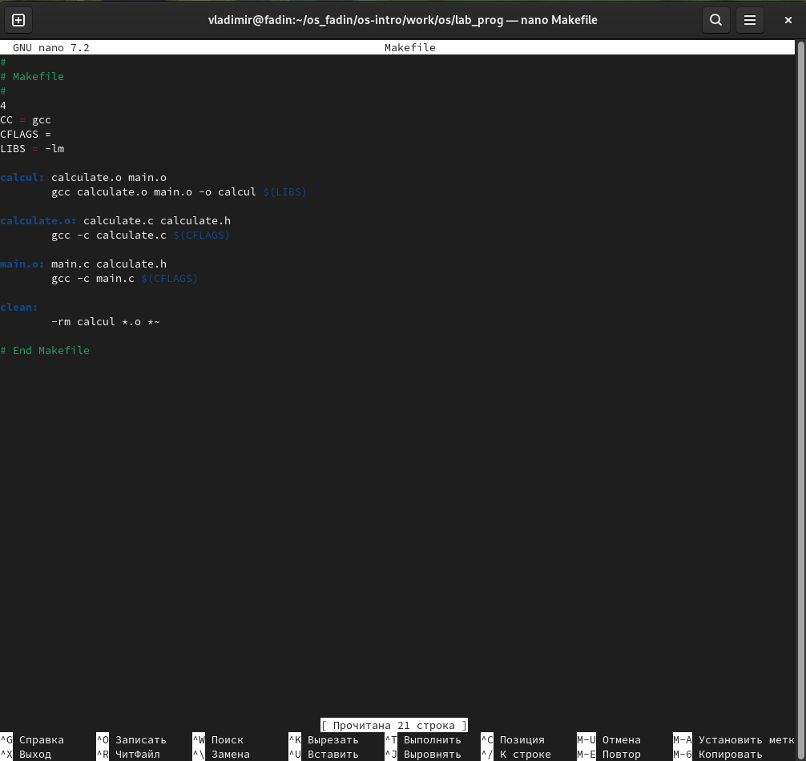
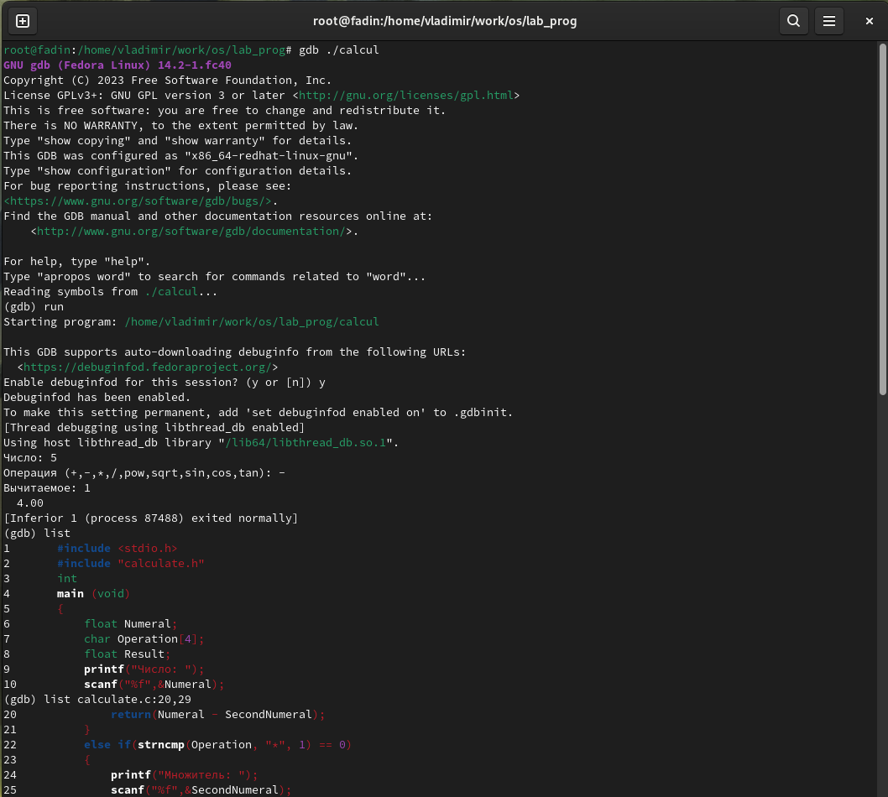
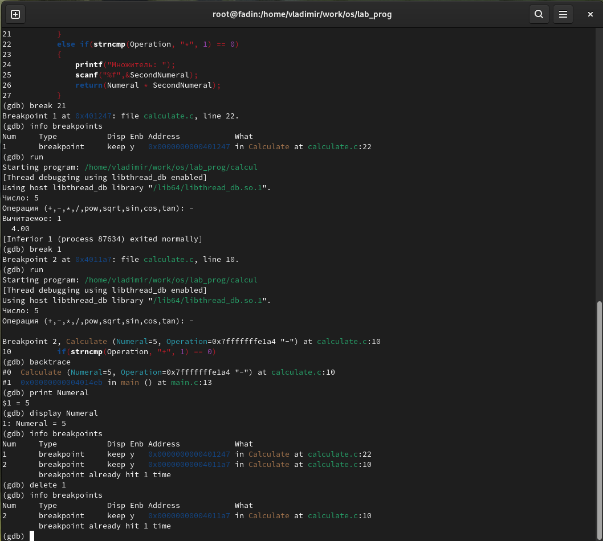

---
## Front matter
title: "Отчет по лабораторной работе №12"
subtitle: "Операционные системы"
author: "Фадин В.В."

## Generic otions
lang: ru-RU
toc-title: "Содержание"

## Bibliography
bibliography: bib/cite.bib
csl: pandoc/csl/gost-r-7-0-5-2008-numeric.csl

## Pdf output format
toc: true # Table of contents
toc-depth: 2
lof: true # List of figures
lot: true # List of tables
fontsize: 12pt
linestretch: 1.5
papersize: a4
documentclass: scrreprt
## I18n polyglossia
polyglossia-lang:
  name: russian
  options:
	- spelling=modern
	- babelshorthands=true
polyglossia-otherlangs:
  name: english
## I18n babel
babel-lang: russian
babel-otherlangs: english
## Fonts
mainfont: PT Serif
romanfont: PT Serif
sansfont: PT Sans
monofont: PT Mono
mainfontoptions: Ligatures=TeX
romanfontoptions: Ligatures=TeX
sansfontoptions: Ligatures=TeX,Scale=MatchLowercase
monofontoptions: Scale=MatchLowercase,Scale=0.9
## Biblatex
biblatex: true
biblio-style: "gost-numeric"
biblatexoptions:
  - parentracker=true
  - backend=biber
  - hyperref=auto
  - language=auto
  - autolang=other*
  - citestyle=gost-numeric
## Pandoc-crossref LaTeX customization
figureTitle: "Рис."
tableTitle: "Таблица"
listingTitle: "Листинг"
lofTitle: "Список иллюстраций"
lotTitle: "Список таблиц"
lolTitle: "Листинги"
## Misc options
indent: true
header-includes:
  - \usepackage{indentfirst}
  - \usepackage{float} # keep figures where there are in the text
  - \floatplacement{figure}{H} # keep figures where there are in the text
---

# Цель работы

Приобрести простейшие навыки разработки, анализа, тестирования и отладки приложений в ОС типа UNIX/Linux на примере создания на языке программирования
С калькулятора с простейшими функциями.

# Выполнение лабораторной работы

## Задача 1

В домашнем каталоге создадим подкаталог `~/work/os/lab_prog`. Создадим в нём файлы: `calculate.h`, `calculate.c`, `main.c` из лабораторной работы.

{#fig:001 width=70%}

Выполним компиляцию программы посредством gcc:

{#fig:002 width=70%}

После обнаружил, что необходимо собирать программу с помощью команды, чтобы gdb работал корректно:
`gcc -g calculate.c main.c -o calcul -lm`

Создадим необходимый `Makefile`

{#fig:003 width=70%}

Этот Makefile компилирует программу под названием «calcul» из двух исходных файлов: «calculate.c» и «main.c». Он использует компилятор `gcc` и связывается с математической библиотекой. `Makefile` определяет три скрипта:

* `calcul`: связывает `calculate.o` и `main.o` в исполняемый файл.
* `calculate.o` и `main.o`: скомпилирует `calculate.c` и `main.c` в объектные файлы соответственно.
* `clean`: удаляет исполняемый файл, объектные файлы и файлы резервных копий.

После запуска `make`, он проверит зависимости и перенастроит скрипты по мере необходимости.

С помощью `gdb` выполним отладку программы `calcul` по пунктам

{#fig:004 width=70%}

{#fig:005 width=70%}

С помощью утилиты `splint` проанализируем коды файлов calculate.c и main.c:

{#fig:006 width=70%}

Вывод `splint` указывает на то, что существует несколько потенциальных проблем с кодом `calculate.c` и `main.c`. Вот разбивка предупреждений:

**Объявления массива манифеста**

* «calculate.h:3:37» и «calculate.c:7:31»: параметр «Operation» объявляется как массив с размером, но размер игнорируется, поскольку массив рассматривается как указатель. Это не ошибка, а скорее предупреждение о том, что указание размера не имеет смысла в данном контексте.

**Игнорируемые возвращаемые значения**

* `calculate.c:13:9`, `calculate.c:19:9`, `calculate.c:25:9`, `calculate.c:31:9`, `calculate.c:43:9` и `main.c:10:5`: возвращаемые значения вызовов `scanf` игнорируются. Это не обязательно ошибка, но это предупреждение, напоминающее вам, что возвращаемое значение `scanf` может указывать, был ли ввод успешным.

**Опасные сравнения с плавающей запятой**

* `calculate.c:32:12`: Код сравнивает значение с плавающей запятой (`SecondNumeral`) напрямую, используя `==`, что может привести к неожиданным результатам из-за неточной природы представлений с плавающей запятой. Вместо этого рекомендуется сравнивать разницу с небольшим значением эпсилон.

**Несоответствие типов**

* `calculate.c:35:19`, `calculate.c:44:15`, `calculate.c:47:15`, `calculate.c:49:15`, `calculate.c:51:15` и `calculate.c:53:15`: типы возвращаемых значений некоторых выражений не соответствуют объявленным типам. Например, HUGE_VAL — это двойное значение, но оно присваивается переменной с плавающей запятой.

**Проблемы со строкой форматирования**

* `main.c:12:5`: строка формата `%s` ожидает аргумент `char *`, но вместо этого код передает аргумент `char *`. Это может привести к неопределенному поведению.

В целом эти предупреждения предполагают, что в коде могут быть некоторые проблемы с объявлениями массивов, игнорированием возвращаемых значений, опасными сравнениями с плавающей запятой, несовпадениями типов и несогласованностью строк формата.

# Выводы

Мы приобрели простейшие навыки разработки, анализа, тестирования и отладки приложений в ОС типа UNIX/Linux на примере создания на языке программирования
С калькулятора с простейшими функциями.

# Ответы на онтрольные вопросы

1. Чтобы получить информацию о возможностях таких программ, как `gcc`, `make`, `gdb` и других, вы можете использовать опцию `--help` или `-h`, за которой следует имя программы. Например, `gcc --help` или `gdb -h`. Это отобразит использование и параметры для каждой программы.
2. Основными этапами разработки приложений в UNIX являются:
* **Редактирование**: написание исходного кода с помощью текстового редактора.
* **Компиляция**: перевод исходного кода в машинный код с использованием компилятора, такого как gcc.
* **Связывание**: объединение объектных файлов в исполняемый файл с помощью компоновщика, такого как `ld`.
* **Отладка**: выявление и исправление ошибок в программе с помощью отладчика, такого как `gdb`.
* **Тестирование**: проверка правильности работы программы.
3. В контексте языков программирования суффикс — это символ или набор символов, добавляемый в конец имени переменной или функции для обозначения ее типа или назначения. Например, `myVariable_i` может указывать на целочисленную переменную, а `myFunction_f` может указывать на функцию с плавающей запятой.
4. Основная цель компилятора C в UNIX — преобразовать исходный код C в машинный код, который может выполняться компьютером.
5. Утилита make используется для автоматизации процесса сборки путем выполнения серии команд, указанных в Makefile. Он проверяет зависимости между файлами и перестраивает только то, что необходимо.
6. Базовая структура Makefile состоит из:
* **Цели**: файлы, которые необходимо создать, например исполняемые файлы или объектные файлы.
* **Зависимости**: файлы, необходимые для сборки целевых объектов, например исходные файлы или библиотеки.
* **Команды**: действия, которые необходимо предпринять для создания целей, например компиляция или связывание.
7. Главным свойством, общим для всех программ-отладчиков, является возможность **пошагового выполнения кода**, проверяя состояние переменных и регистров на каждом этапе. Чтобы использовать эту функцию, вам необходимо скомпилировать программу с включенными символами отладки (флаг «-g») и запустить ее под отладчиком, например «gdb».
8. Основные команды `gdb`:
* `run`: запускает выполнение программы.
* `break`: устанавливает точку останова в определенном месте.
* `next`: выполняет следующую строку кода.
* `step`: выполняет следующую инструкцию, переходя к функциям.
* `print`: отображает значение переменной.
* `backtrace`: отображает стек вызовов.
9. Схема отладки, которую я использовал в этой лабораторной работе, включала:
* Компиляция программы с включенными символами отладки (`gcc -g`).
* Запуск программы под `gdb` (`gdb ./program`).
* Установка точек останова в определенных местах («break main»).
* Прохождение кода, проверка переменных и регистров («next», «step», «print»).
* Анализ стека вызовов («backtrace»).
10. Когда компилятор обнаруживает синтаксическую ошибку, он обычно отображает сообщение об ошибке с указанием номера строки и характера ошибки. Компилятор не создаст исполняемый файл, пока не будут исправлены все синтаксические ошибки.
11. Основными инструментами для понимания исходного кода являются:
* **Отладчики**: такие как gdb, которые позволяют пошагово выполнять код и проверять переменные.
* **Инструменты анализа кода**: например, «сплинт», который проверяет наличие потенциальных проблем и предупреждает о возможных ошибках.
* **Документация**: комментарии и документация внутри самого кода.
12. Основными задачами, решаемыми "шиной", являются:
* **Обнаружение утечек памяти**: выявление потенциальных утечек памяти.
* **Обнаружение разыменования нулевого указателя**: предупреждение о потенциальных разыменованиях нулевого указателя.
* **Проверка границ массива**: проверка доступа к массиву за пределами границ.
* **Обнаружение несоответствия типов**: выявление несоответствия типов между переменными и параметрами функции.
